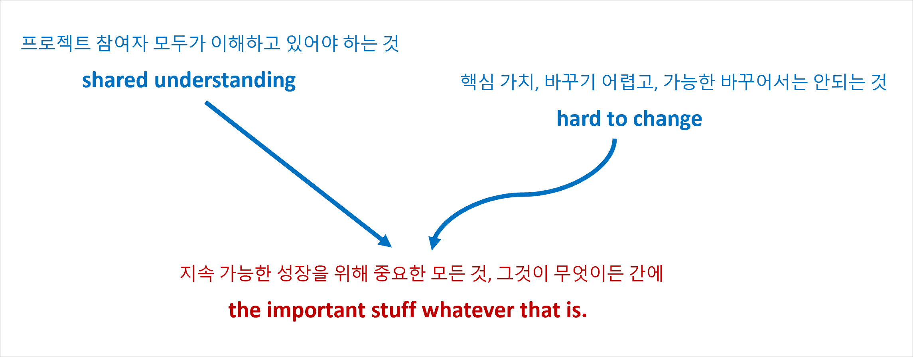
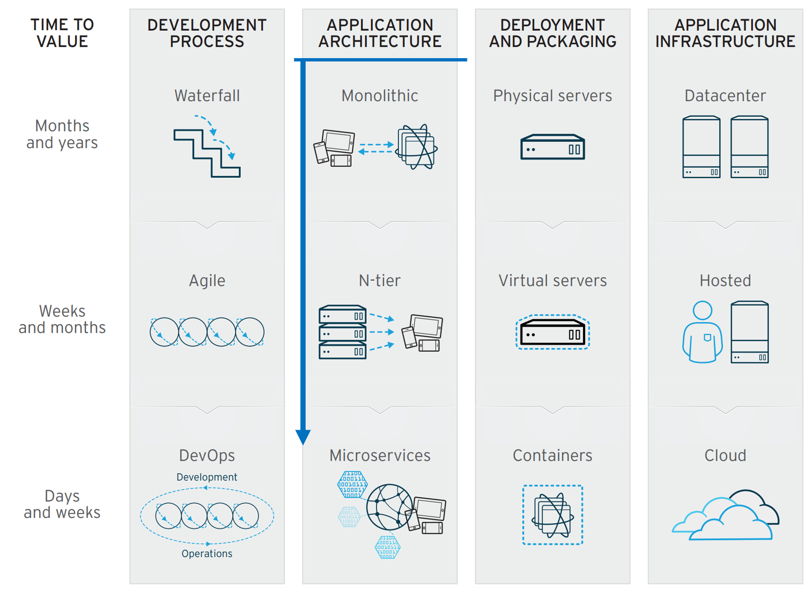
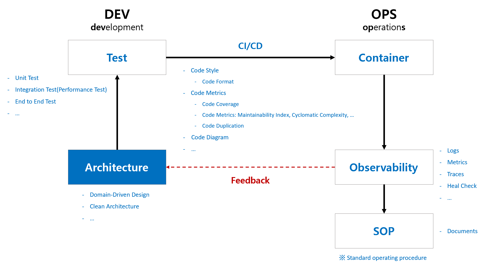

# CLEAN ARCHITECTURE and DOMAIN-DRIVEN DESIGN

[](https://github.com/hhko/ArchDdd/actions/workflows/build.yml)
[](https://codecov.io/gh/hhko/ArchDdd)

> 배움은 **설렘**이다.  
> 배움은 **겸손**이다.  
> 배움은 **이타심**이다.

## 개요

지속 가능한 코드

> **회귀 버그(Regression Bug)**
> - 기존에 잘 작동하던 기능이 새로운 코드 변경이나 업데이트로 인해 갑자기 오작동하게 되는 문제를 말합니다.  
> - **회귀 버그는 지속 가능한 코드의 길에서 마주치는 가장 큰 골칫거리입니다.**

> - `개발: 배포 전`
>   - 부수 효과(Side Effect)
>   - 성능
> - `운영: 배포 후`
>   - 재배포 속도
>   - 장애 사전 예측 속도
>   - 장애 사후 복구 속도
>   - 표준 운영 절차 문서(SOP, Standard operating procedure)

### 배경

- **개발은 글쓰기와 같습니다.**  
  개발자는 프로그래밍 언어로 이야기를 코드로 써 내려갑니다.
- **솔루션 탐색기의 폴더 구성은 책의 목차와 같습니다.**  
  각 폴더(레이어)는 책의 챕터처럼 관련 내용(관심사)을 담고 있습니다.
- **목차를 따라 코드를 읽으면 비즈니스의 흐름을 이해할 수 있습니다.**   
  코드는 비즈니스의 작동 방식을 설명하는 상세한 설명서와 같기 때문입니다.

### 목표
- 지속 가능한 코드: 코드가 문서입니다.
  - **`비즈니스 이해  --{글 쓰기}--> 코드`**: 비즈니스를 이해하면 코드를 배치할 수 있습니다.
  - **`비즈니스 이해 <--{글 읽기}--  코드`**: 코드를 읽으면 비즈니스를 이해할 수 있습니다.

<br/>

## 아키텍처 이해
### 아키텍처 중요성
건축업자가 프로그래머의 프로그램 작성 방식에 따라 건물을 짓는다면 가장 먼저 도착하는 딱따구리가 문명을 파괴할 것입니다.  
If builders built buildings the way programmers wrote programs, then the first woodpecker that came along would destroy civilization. - Gerald Weinberg
- Architecting is a series of **trade-offs**.
- The architecture should scream **the intent of the system**.

### 아키텍처 정의

※ 출처: [Making Architecture Matter, 소프트웨어 아키텍처의 중요성](https://www.youtube.com/watch?v=4E1BHTvhB7Y)  

- 아키텍처는 제품의 지속 가능한 성장을 주도하는 중요한 모든 것(`The important stuff whatever that is`)입니다.
  - 예. 기능을 추가할 때?
    - 관련 코드의 시작 지점을 찾는 것은 쉽지만, 그 기능이 미치는 영향을 끝까지 파악하는 것은 어렵습니다.
    - **끝 지정(부수 효과, Side Effect)를** 모두 인지하는 것은 쉽지 않습니다.

### 아키텍처 원칙


- 관심사의 분리(SoC, Separation of Concerns)
  - 아키텍처 수준에서는 **비즈니스와 기술적인 관심사**를 명확히 구분합니다.
  - 비즈니스와 관련된 부분은 비즈니스 영역에서, 기술적인 부분은 기술 영역에서 각각 다루어지도록 하는 것입니다.
  - 기술적 구현에 의존하지 않고도 비즈니스만을 집중하여 테스트하고 개선할 수 있습니다.

### 아키텍처 범주

※ 출처: [Making old applications new again](https://sellingsimplifiedinsights.com/asset/app-development/ASSET_co-modernization-whitepaper-inc0460201-122016kata-v1-en_1511772094768.pdf)

```
Application Architecture
  ├─ Backend
  │   ├─ Monolithic Architecture
  │   ├─ Modular Monolithic Architecture
  │   ├─ N-tier Architecture
  │   └─ Microservices Architecture
  │       ├─ Inner Architecture
  │       │    └─ Layered Architecture
  │       │         ├─ Hexagonal Architecture       <--
  │       │         ├─ Onion Architecture
  │       │         ├─ Clean Architecture           <--
  │       │         └─ Vertical Slice Architecture
  │       │
  │       └─ Outer Architecture
  │            └─ 외부 시스템 구성 아키텍처: 예. CNCF Landscape
  │
  └─ Frontend
      └─ Inner Architecture
          └─ Layered Architecture
               ├─ Hexagonal Architecture            <--
               ├─ Onion Architecture
               ├─ Clean Architecture                <--
               ├─ Vertical Slice Architecture
               └─ + UI 특화 Architecture: 예. MVVM, ...
```
- 백엔드와 프론트엔드 대부분 **관심사를 계층(Layer)로 관리하는** 계층형 아키텍처 기반의 진화된 아키텍처를 사용합니다.

### 아키텍처 역사


- 1992년부터 아키텍처 수준에서는 관심사를 계층(Layer)으로 나누고, 객체 수준에서는 관심사를 엔티티(Entity)로 관리하는 방법이 제시되었습니다.
- 즉, 시스템의 큰 구조는 여러 계층으로 나누어 관리하고, 각 계층 내의 세부 사항은 엔티티로 나누어 관리하는 방식입니다.

### 아키텍처 역할


- 아키텍처는 제품의 **선순환(Good Cycle)** 성장의 시작점입니다.

<br/>

## 아키텍처 구현
- TODO: 주요 구현을 정리합니다.

<br/>

## 개발 환경
- .NET 8.x
- Visual Studio Code
  - C#
  - ~~C# Dev Kit~~
  - Code Spell Checker
  - Git Graph
  - Paste Image
  - Trailing Spaces
  - Markdown Preview Enhanced
  - VSCode Progressive Increment
  - ~~GitHub Actions~~
  - ~~Codecov YAML Validator~~
  - REST Client

### 패키지
- `Ulid`: GUID
- `Quartz`: 백그라운드 작업
- `MediatR`: Mediator 패턴
- `EF Core`: ORM
- `OpenTelemetry`: Telemetry
- `FluentValidation`: 유효성 검사 선언형

### 테스트
- `xunit`: 단위 테스트
- `Verify.Xunit`: Snapshot 테스트
- `FluentAssertions`: Assert 선언형
- `NetArchTest.Rules`: 아키텍처 테스트
- `coverlet.collector`: 코드 커버리지
- `Xunit.DependencyInjection`: xUnit 의존성
- `Microsoft.AspNetCore.Mvc.Testing`: 통합 테스트

### 문서
- `docusaurus`

### 도구
- `verify.tool`
