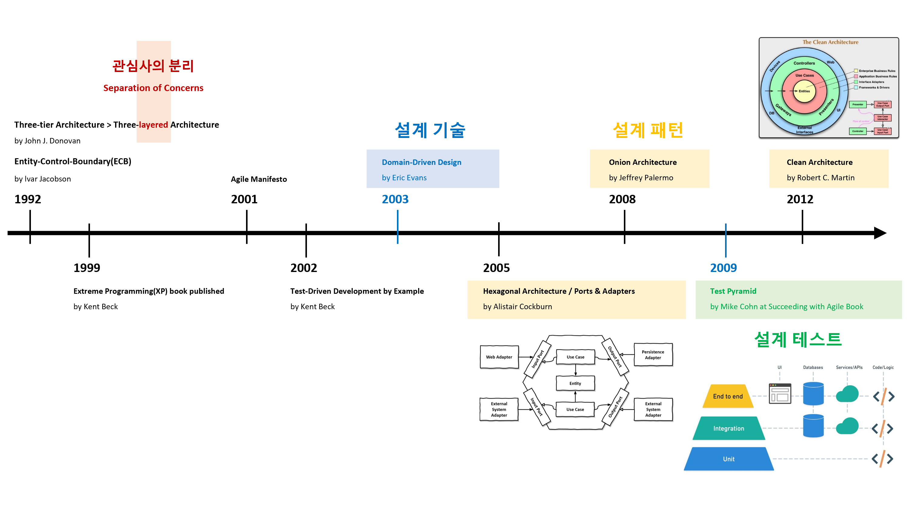

# Domain-Driven Design with Clean Architecture
[](https://github.com/hhko/CleanDdd/actions/workflows/dotnet-ci.yml)

> 배움은 **설렘**이다.  
> 배움은 **겸손**이다.  
> 배움은 **이타심**이다.

건축업자가 프로그래머의 프로그램 작성 방식에 따라 건물을 짓는다면 가장 먼저 도착하는 딱따구리가 문명을 파괴할 것입니다.  
If builders built buildings the way programmers wrote programs, then the first woodpecker that came along would destroy civilization. - Gerald Weinberg
- Architecting is a series of **trade-offs**.
- The architecture should scream **the intent of the system**.

## 아키텍처 이해
아키텍처 첫번째 원칙은 **관심사의 분리**(Separation of Concerns, SoC)입니다. 분리한 관심사를 아키텍처는 **레이어**(Layer)로 정의하여 관심사를 관리합니다. 아키텍처 역사를 통해 이를 재확인할 수 있습니다. 아키텍처는 레이어 정의, 배치 그리고 관계를 기준으로 **아키텍처 패턴**을 구성하고 있습니다.
- Layered Architecture
- Hexagonal Architecture
- Onion Architecture
- Clean Architecture
- ...



## 목차
- [튜토리얼](./tutorials/)

## 폴더 구성
### src 폴더 구성


```
T1.T2{.T3}

src
  ├─ CleanDdd.Domain                   : Domain
  ├─ CleanDdd.Application              : Application
  ├─ CleanDdd.Adapters.Infrastructure  : Adapter
  ├─ CleanDdd.Adapters.Persistence     : Adapter
  ├─ CleanDdd.Adapters.Presentation    : Adapter
  └─ CleanDdd.Host                     : Host
```
- `T1`: Solution 이름
- `T2`: Layer 이름
  - `Domain` ⊂ `Application` ⊂ `Adapter` ⊂ `Host`
- `T3`: Feature 이름(생략 가능)
  - Presentation, Infrastructure, Persistence, ...

### tests 폴더 구성


```
T1.T2.T3

tests
  ├─ CleanDdd.Tests.Integration        : Test
  └─ CleanDdd.Tests.Unit               : Test
```
- `T1`: Solution 이름
- `T2`: Layer 이름
  - `Test`
- `T3`: Feature 이름(테스트 피라미드)
  - `Unit` ⊂ `Integration` ⊂ `E2E`

### site 폴더 구성
```
site
  ├─ docs                              : .md 파일 문서화
  ├─ api                               : .cs XML 주석 문서화
  └─ _site                             : 빌드 결과
```


## 개발 환경
- .NET 8.x
- Visual Studio Code
  - C#
  - ~~C# Dev Kit~~
  - Code Spell Checker
  - Git Graph
  - Paste Image
  - Trailing Spaces
  - Markdown Preview Enhanced

### dotnet tools
```shell
# docfx
#   - Install Visual Studio 2022 (Community or higher) and make sure you have the latest updates.
#   - Install .NET SDK 6.x, 7.x and 8.x.
#   - Install NodeJS (20.x.x).
dotnet tool install -g docfx --version 2.75.3

# dotnet-format
dotnet tool install -g dotnet-format --version 5.1.250801
```
