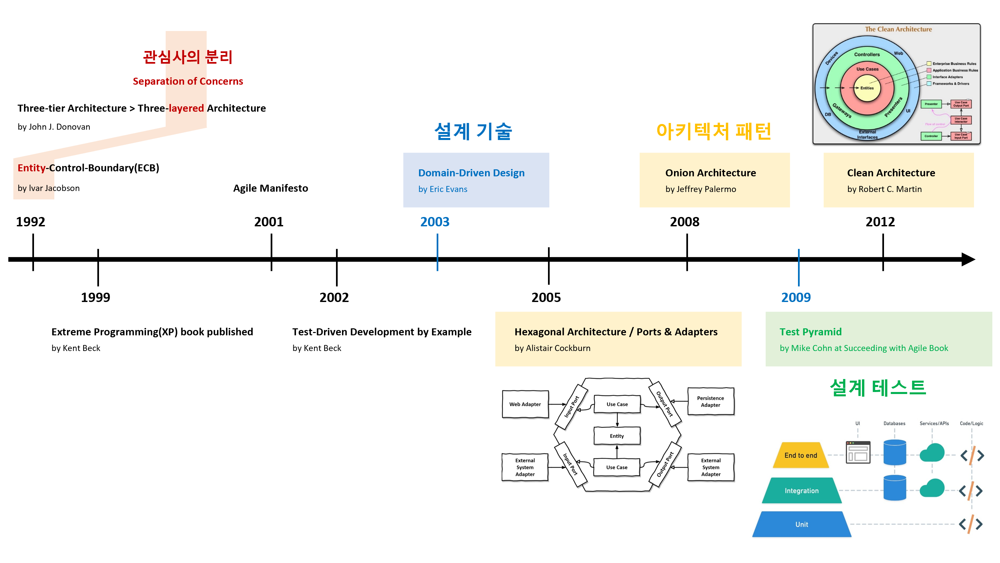
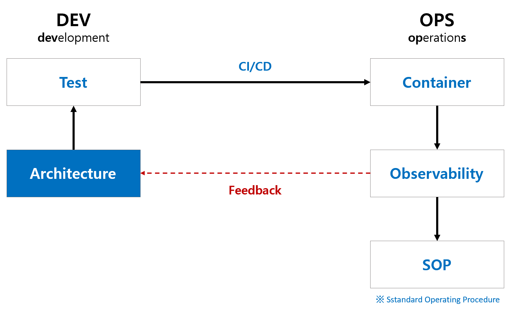
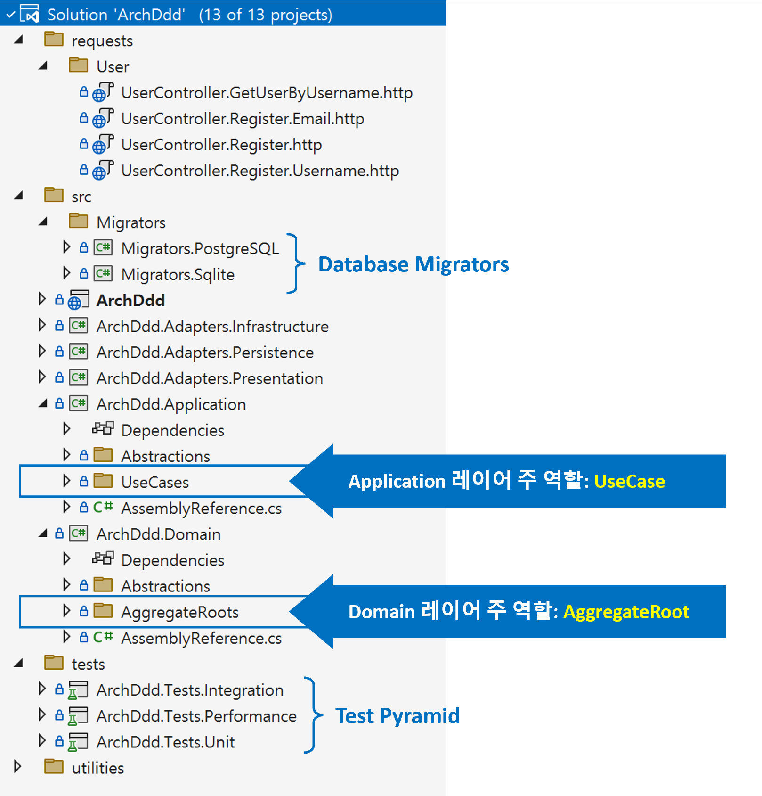

# CLEAN ARCHITECTURE and DOMAIN-DRIVEN DESIGN

> 배움은 **설렘**이다.  
> 배움은 **겸손**이다.  
> 배움은 **이타심**이다.

## 개요
### 배경
- **개발은 글쓰기와 같습니다.**  
  개발자는 프로그래밍 언어로 이야기를 코드로 써 내려갑니다.
- **솔루션 탐색기의 폴더 구성은 책의 목차와 같습니다.**  
  각 폴더는 책의 챕터처럼 관련 내용(관심사)을 담고 있습니다.
- **목차를 따라 코드를 읽으면 비즈니스의 흐름을 이해할 수 있습니다.**   
  코드는 비즈니스의 작동 방식을 설명하는 상세한 설명서와 같기 때문입니다.

### 목표
- 지속 가능한 성장
  - `코드  --{글 읽기}--> 비즈니스 이해`: 코드를 읽으면 비즈니스를 이해할 수 있습니다.
  - `코드 <--{글 쓰기}--  비즈니스 이해`: 비즈니스를 이해하면 코드를 작성할 수 있습니다.

## 아키텍처 이해
### 아키텍처 원칙
**관심사의 분리(SoC, Separation of Concerns)은** 중요한 아키텍처 원칙 중 하나입니다. 이는 **관심사**를 분리함으로써 코드를 더 잘 관리할 수 있다는 개념입니다. 아키텍처 수준의 관심사는 각각의 **레이어**로 나눠져 관리됩니다.
> **레이어 기반 아키텍처 패턴의 역사**는 **관심사**를 관리하기 위한 **레이어 배치의 역사**입니다.

- Layered Architecture
- Hexagonal Architecture
- Onion Architecture
- Clean Architecture
- ...

### 아키텍처 관심사
관심사를 **비즈니스와 기술**로 분리하고, **비즈니스 유스케이스 중심**으로 관심사를 구성합니다.

### 아키텍처 DevOps

- 아키텍처는 DevOps **선순환(Good Cycle)** 성장의 시작입니다.

### 아키텍처 레이어

- 관심사를 레이어 단위로 관리합니다.
  - **기술 관심사**
    - `Adapter`: 외부 시스템과의 상호작용
  - **비즈니스 관심사**
    - `Application`: UseCase
    - `Domain`: AggregateRoot

## 개발 환경
- .NET 8.x
- Visual Studio Code
  - C#
  - ~~C# Dev Kit~~
  - Code Spell Checker
  - Git Graph
  - Paste Image
  - Trailing Spaces
  - Markdown Preview Enhanced
  - VSCode Progressive Increment
  - ~~GitHub Actions~~
  - ~~Codecov YAML Validator~~
  - REST Client

### 패키지
- `Ulid`: GUID
- `Quartz`: 백그라운드 작업
- `MediatR`: Mediator 패턴
- `EF Core`: ORM
- `OpenTelemetry`: Telemetry
- `FluentValidation`: 유효성 검사 선언형

### 테스트
- `xunit`: 단위 테스트
- `Verify.Xunit`: Snapshot 테스트
- `FluentAssertions`: Assert 선언형
- `NetArchTest.Rules`: 아키텍처 테스트
- `coverlet.collector`: 코드 커버리지
- `Xunit.DependencyInjection`: xUnit 의존성
- `Microsoft.AspNetCore.Mvc.Testing`: 통합 테스트

### 문서
- `docusaurus`

### 도구
- `verify.tool`
