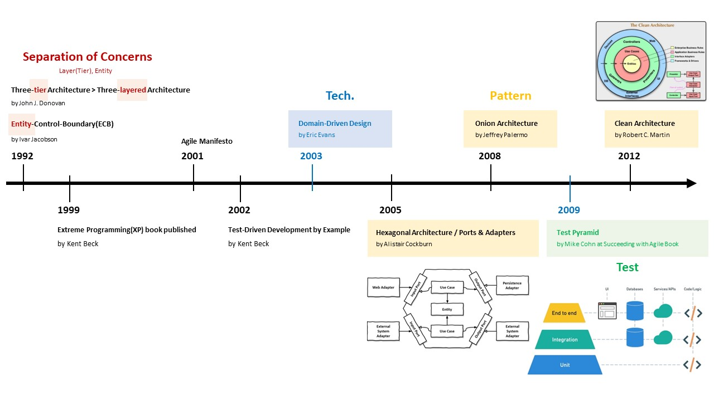
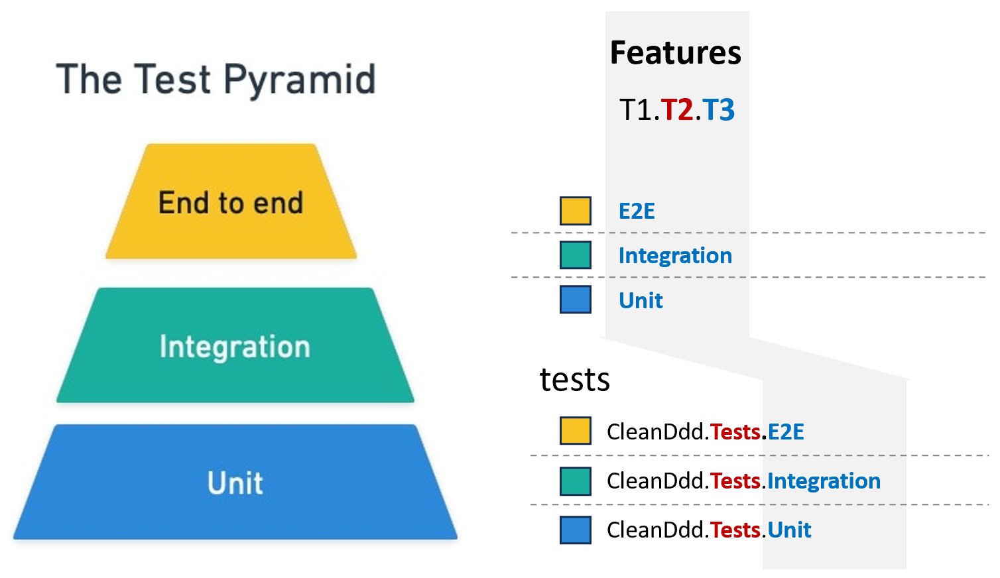

# Domain-Driven Design with Clean Architecture
[](https://github.com/hhko/CleanDdd/actions/workflows/dotnet.yml)

> 배움은 **설렘**이다.  
> 배움은 **겸손**이다.  
> 배움은 **이타심**이다.

건축업자가 프로그래머의 프로그램 작성 방식에 따라 건물을 짓는다면 가장 먼저 도착하는 딱따구리가 문명을 파괴할 것입니다.  
If builders built buildings the way programmers wrote programs, then the first woodpecker that came along would destroy civilization. - Gerald Weinberg
- Architecting is a series of **trade-offs**.
- The architecture should scream **the intent of the system**.

## 아키텍처 이해
아키텍처 첫 번째 원칙은 **관심사의 분리**(Separation of Concerns, SoC)입니다. 아키텍처는 관심사 기준으로 분리하여 **레이어**(Layer)로 정의합니다. 초창기 아키텍처 패턴 `Layered Architecture`부터 모든 아키텍처 패턴은 **레이어** 단위로 구성합니다.
> **아키텍처 패턴의 역사는 레이어 배치의 역사입니다.**

- Layered Architecture
- Hexagonal Architecture
- Onion Architecture
- Clean Architecture
- ...



## 목차
- [튜토리얼](./tutorials/)

## 폴더 구성
### src 폴더 구성


```
T1.T2{.T3}

src
  ├─ CleanDdd.Domain                   : Domain
  ├─ CleanDdd.Application              : Application
  ├─ CleanDdd.Adapters.Infrastructure  : Adapter
  ├─ CleanDdd.Adapters.Persistence     : Adapter
  ├─ CleanDdd.Adapters.Presentation    : Adapter
  └─ CleanDdd.Host                     : Host
```
- `T1`: Solution 이름
- `T2`: Layer 이름
  - `Domain` ⊂ `Application` ⊂ `Adapter` ⊂ `Host`
- `T3`: Feature 이름(생략 가능)
  - Presentation, Infrastructure, Persistence, ...

### tests 폴더 구성


```
T1.T2.T3

tests
  ├─ CleanDdd.Tests.Integration        : Test
  └─ CleanDdd.Tests.Unit               : Test
```
- `T1`: Solution 이름
- `T2`: Layer 이름
  - `Test`
- `T3`: Feature 이름(테스트 피라미드)
  - `Unit` ⊂ `Integration` ⊂ `E2E`

### site 폴더 구성
```
site
  ├─ docs                              : .md 파일 문서화
  ├─ api                               : .cs XML 주석 문서화
  └─ _site                             : 빌드 결과
```


## 개발 환경
- .NET 8.x
- Visual Studio Code
  - C#
  - ~~C# Dev Kit~~
  - Code Spell Checker
  - Git Graph
  - Paste Image
  - Trailing Spaces
  - Markdown Preview Enhanced
  - VSCode Progressive Increment

### dotnet tools
```shell
# dotnet-format
dotnet tool install -g dotnet-format --version 5.1.250801
```
