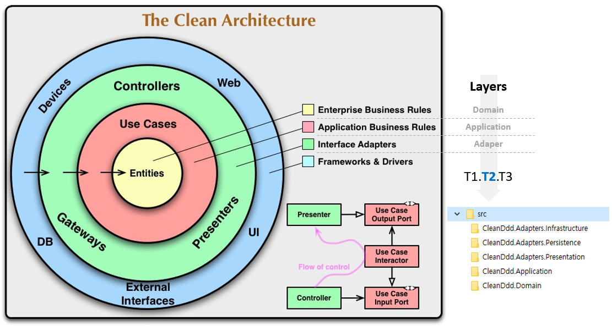
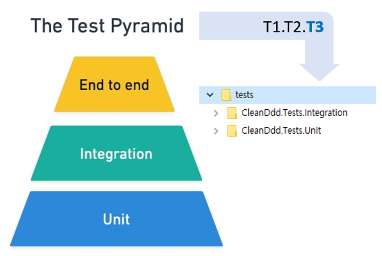

# Clean Architecture with Domain-Driven Design

> 배움은 **설렘**이다.  
> 배움은 **겸손**이다.  
> 배움은 **이타심**이다.

If builders built buildings the way programmers wrote programs, then the first woodpecker that came along would destroy civilization. - Gerald Weinberg
- Architecting is a series of **trade-offs**.
- The architecture should scream **the intent of the system**.

## 목차
- [튜토리얼](./tutorials/)

## 폴더 구성
### src 폴더 구성

```
T1.T2{.T3}
```
- `T1`: 솔루션 이름
- `T2`: 레이어 이름
  - `Adaper`
  - `Application`
  - `Domain`
- `T3`: 세부 이름
  - Presentation, Infrastructure, Persistence, ...

### tests 폴더 구성


```
T1.T2{.T3}
```
- `T1`: 솔루션 이름
- `T2`: `Tests`
- `T3`: 테스트 피라미드
  - Unit, Integration, E2E

## 개발 환경
- .NET 8.x
- Visual Studio Code
  - C#
  - ~~C# Dev Kit~~
  - Code Spell Checker
  - Git Graph
  - Paste Image
  - Trailing Spaces
  - Markdown Preview Enhanced

### dotnet tools
```shell
# docfx
#   - Install Visual Studio 2022 (Community or higher) and make sure you have the latest updates.
#   - Install .NET SDK 6.x, 7.x and 8.x.
#   - Install NodeJS (20.x.x).
dotnet tool install -g docfx --version 2.75.3

# dotnet-format
dotnet tool install -g dotnet-format --version 5.1.250801
```

## 참고 자료
### GitHub
- [jasontaylordev/CleanArchitecture](https://github.com/jasontaylordev/CleanArchitecture/)
- [ardalis/CleanArchitecture](https://github.com/ardalis/CleanArchitecture/)
- [amantinband/CleanArchitecture](https://github.com/amantinband/clean-architecture)
- [eShopOnWeb](https://github.com/dotnet-architecture/eShopOnWeb)

### 문서
- [The Testing Pyramid: How to Structure Your Test Suite](https://semaphoreci.com/blog/testing-pyramid)
