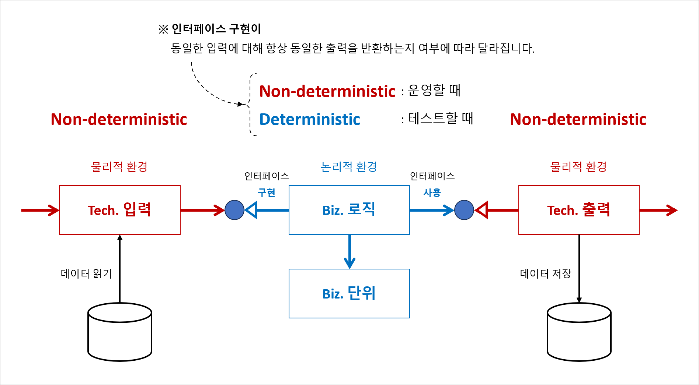

# CLEAN ARCHITECTURE and DOMAIN-DRIVEN DESIGN

[](https://github.com/hhko/ArchDdd/actions/workflows/build.yml)
[](https://codecov.io/gh/hhko/ArchDdd)

> 배움은 **설렘**이다.  
> 배움은 **겸손**이다.  
> 배움은 **이타심**이다.

## 개요

> **지속 가능한 코드**

지속 가능한 코드는 마치 한 편의 아름다운 시와 같습니다. 한 번 쓰여진 후, 시간이 흘러도 그 의미와 가치가 바래지 않고, 읽는 이에게 꾸준히 감동을 주는 것입니다. 이런 코드를 작성하는 일은 단순히 기능을 구현하는 것을 넘어서, **코드의 아름다움과 명료함을 추구하는 일입니다.**  

저는 종종 코드를 한 그루의 나무에 비유하곤 합니다. 나무는 처음 심을 때는 작고 연약하지만, 시간이 흐르면서 뿌리를 내리고, 가지를 뻗어 결국 울창한 숲을 이루게 됩니다. 지속 가능한 코드도 마찬가지입니다. 처음 작성할 때는 작은 부분에 불과할지 모르지만, 시간이 지나면서 점점 더 많은 기능을 포함하게 되고, 더 많은 사람이 그 코드를 사용하고 유지보수하게 됩니다.   

지속 가능한 코드를 작성하는 것은 단순한 기술적 문제를 해결하는 것을 넘어, 미래를 내다보는 안목과 책임감을 요구하는 일입니다. 코드는 작성자의 철학과 가치관을 반영하는 작품이기 때문입니다. 저는 코드를 작성할 때 항상 다음과 같은 질문을 스스로에게 던집니다.  

- **이 코드가 시간이 지나도 쉽게 이해되고 유지보수될 수 있을까?**
- **이 코드가 다른 사람들과 협업하는 데 있어 장애물이 되지 않을까?**
- **이 코드가 변화하는 요구사항에 유연하게 대응할 수 있을까?**

이러한 질문들은 제가 지속 가능한 코드를 작성하는 데 있어 나침반 역할을 해줍니다. 가독성이 높은 코드, 잘 정의된 인터페이스, 그리고 적절한 테스트 케이스는 제가 추구하는 지속 가능한 코드의 요소들입니다.  

그러나 지속 가능한 코드를 작성하는 일은 결코 쉬운 일이 아닙니다. 때로는 당장의 마감 기한에 쫓겨 임시방편으로 문제를 해결하고 싶은 유혹에 빠지기도 합니다. 그러나 저는 언제나 긴 호흡으로 바라보려 합니다. 일시적인 해결책보다는 장기적인 관점에서의 품질을 더 중요하게 생각합니다.  

제가 꿈꾸는 것은, **제가 작성한 코드가 나중에 누군가에게 읽고 싶어하는 코드가 되는 것입니다.** 그것이 코드를 작성하는 저의 이유이며, 제가 지속 가능한 코드를 위해 끊임없이 노력하는 이유입니다. 그리고 이 여정은 저 혼자만의 것이 아닙니다. 저와 같은 꿈을 꾸는 많은 개발자들이 함께 만들어가는 길입니다.  

결국, 지속 가능한 코드를 작성하는 것은 단순한 기술적 문제를 넘어서, 인간적인 문제이기도 합니다. 서로를 배려하고, 존중하며, 함께 성장하는 것이야말로 지속 가능한 코드를 위한 가장 중요한 요소라고 믿습니다.  

이것이 바로 지속 가능한 코드를 위한 저의 이야기입니다. 저는 오늘도 그 이야기를 써 내려가며, 미래를 향해 한 걸음 한 걸음 나아갑니다.  

> **회귀 버그(Regression Bug)**
> - 기존에 잘 작동하던 기능이 새로운 코드 변경이나 업데이트로 인해 갑자기 오작동하게 되는 문제를 말합니다.
> - **회귀 버그는 지속 가능한 코드 작성 과정에서 가장 큰 기술적 도전 중 하나입니다.**
>   - `개발`
>     - 부수 효과(Side Effect)
>     - 성능
>   - `운영`
>     - 재배포 속도
>     - 장애 사전 예측 속도
>     - 장애 사후 복구 속도
>     - 표준 운영 절차 문서(SOP, Standard operating procedure)

### 배경

- **개발은 글쓰기와 같습니다.**  
  개발자는 프로그래밍 언어로 이야기를 코드로 써 내려갑니다.
- **솔루션 탐색기의 폴더 구성은 책의 목차와 같습니다.**  
  각 폴더(레이어)는 책의 챕터처럼 관련 내용(관심사)을 담고 있습니다.
- **목차를 따라 코드를 읽으면 비즈니스의 흐름을 이해할 수 있습니다.**   
  코드는 비즈니스의 작동 방식을 설명하는 상세한 설명서와 같기 때문입니다.

### 목표
- 지속 가능한 코드: 코드가 문서입니다.
  - **`비즈니스 이해  --{글 쓰기}--> 코드`**: 비즈니스를 이해하면 코드를 배치할 수 있습니다.
  - **`비즈니스 이해 <--{글 읽기}--  코드`**: 코드를 읽으면 비즈니스를 이해할 수 있습니다.

<br/>

## 아키텍처 이해
### 아키텍처 중요성
건축업자가 프로그래머의 프로그램 작성 방식에 따라 건물을 짓는다면 가장 먼저 도착하는 딱따구리가 문명을 파괴할 것입니다.  
If builders built buildings the way programmers wrote programs, then the first woodpecker that came along would destroy civilization. - Gerald Weinberg
- Architecting is a series of **trade-offs**.
- The architecture should scream **the intent of the system**.

### 아키텍처 정의

※ 출처: [Making Architecture Matter, 소프트웨어 아키텍처의 중요성](https://www.youtube.com/watch?v=4E1BHTvhB7Y)  

- 아키텍처는 제품의 지속 가능한 성장을 주도하는 중요한 모든 것(`The important stuff whatever that is`)입니다.
  - 예. 기능을 추가할 때?
    - 관련 코드의 시작 지점을 찾는 것은 쉽지만, 그 기능이 미치는 영향을 끝까지 파악하는 것은 어렵습니다.
    - **끝 지정(부수 효과, Side Effect)를** 모두 인지하는 것은 쉽지 않습니다.

### 아키텍처 원칙


- 관심사의 분리(SoC, Separation of Concerns)
  - 아키텍처 수준에서는 **비즈니스와 기술적인 관심사**를 명확히 구분합니다.
  - 비즈니스와 관련된 부분은 비즈니스 영역에서, 기술적인 부분은 기술 영역에서 각각 다루어지도록 하는 것입니다.
  - 기술적 구현에 의존하지 않고도 비즈니스만을 집중하여 테스트하고 개선할 수 있습니다.

### 아키텍처 분류

※ 출처: [Making old applications new again](https://sellingsimplifiedinsights.com/asset/app-development/ASSET_co-modernization-whitepaper-inc0460201-122016kata-v1-en_1511772094768.pdf)

```
Application Architecture
  ├─ Backend
  │   ├─ Monolithic Architecture
  │   ├─ Modular Monolithic Architecture
  │   ├─ N-tier Architecture
  │   └─ Microservices Architecture
  │       ├─ Inner Architecture
  │       │    └─ Layered Architecture
  │       │         ├─ Hexagonal Architecture
  │       │         ├─ Onion Architecture
  │       │         ├─ Clean Architecture
  │       │         └─ Vertical Slice Architecture
  │       │
  │       └─ Outer Architecture
  │            └─ 외부 시스템 구성 아키텍처: 예. CNCF Landscape
  │
  └─ Frontend
      └─ Inner Architecture
          └─ Layered Architecture
               ├─ Hexagonal Architecture
               ├─ Onion Architecture
               ├─ Clean Architecture
               ├─ Vertical Slice Architecture
               └─ + UI 특화 Architecture: 예. MVVM, ...
```
- 백엔드와 프론트엔드 대부분 **관심사를 계층(Layer)로 관리하는** 계층형 아키텍처 기반의 진화된 아키텍처를 사용합니다.

### 아키텍처 역사


- 1992년부터 아키텍처 수준에서는 관심사를 계층(Layer)으로 나누고, 객체 수준에서는 관심사를 엔티티(Entity)로 관리하는 방법이 제시되었습니다.
- 즉, 시스템의 큰 구조는 여러 계층으로 나누어 관리하고, 각 계층 내의 세부 사항은 엔티티로 나누어 관리하는 방식입니다.

### 아키텍처 역할


- 아키텍처는 제품의 **선순환(Good Cycle)** 성장의 시작점입니다.

### 아키텍처 의사 결정 기록
> ADR(Architectural Decision Records)  
> 아키텍쳐와 관련된 중요한 의사 결정을 기록해 두는 문서입니다.
- 사례
  - https://sswconsulting.github.io/SSW.CleanArchitecture/
- 도구
  - [dotnet-adr](https://github.com/endjin/dotnet-adr)
  - [log4brains](https://github.com/thomvaill/log4brains)
<br/>

## 아키텍처 구현
### 레이어
#### 관심사 세부 분류


> **레이어 단위로** 특정 관심사를 정의하고 처리합니다
> - Tech. 관심사: Non-deterministic
>   - Tech. 입/출력: Adapter 레이어(사용자 인터페이이스, 데이터 저장소, ...)
> - Biz. 관심사: Deterministic
>   - Biz. 흐름: Application 레이어
>   - Biz. 단위: Domain 레이어

- 레이어 이름 규칙
  ```
  T1.T2{.T3}

  T1: 솔루션
  T2: 레이어(Domain, Application, Adapter)
  T3: 세부 분류(생략 가능)
  ```
- 레이어 이름 적용
  ```
  {솔루션}                            // Tech. 관심사, Non-deterministic, Host

  {솔루션}.Adapters.Infrastructure    // Tech. 관심사, Non-deterministic
  {솔루션}.Adapters.Persistence       // Tech. 관심사, Non-deterministic
  {솔루션}.Adapters.Presentation      // Tech. 관심사, Non-deterministic

  {솔루션}.Application                // Biz. 관심사, Deterministic
  {솔루션}.Domain                     // Biz. 관심사, Deterministic
  ```

### 불순(Impure)
#### 비즈니스 입/출력

- Biz. 관심사(Biz. 흐름과 Biz. 단위)는 비결정론적(Non-deterministic) Tech 관심사(Tech. 출력)에 의존하기 때문에 결정론적(Deterministic) 성질을 잃게 됩니다.
  - **결정론적(Deterministic)**: 예측 가능
    - 정확한 수학적 관계식에 의해 예측
    - 오차(불확실성)를 허용하지 않음
  - **비결정론적(Non-deterministic)**: 예측 불가능
    - 다만, 통계적인 방법으로 만 추정
    - 오차(불확실성)를 허용함

### 순수(Pure, Strategy 패턴)
#### 비즈니스 입/출력 의존성 제거


#### 비즈니스 입/출력 테스트


> **테스트**
> - 단위 테스트(Unit Test): Biz. 관심사을 외부 환경에 의존하지 않고 테스트합니다.(Deterministic).
> - 통합 테스트(Integration Test): Tech. 관심사부터 테스트합니다(Non-deterministic).

- 레이어 이름 규칙
  ```
  T1.T2.T3

  T1: 솔루션
  T2: 레이어(Test)
  T3: 세부 분류(Unit, Integration, E2E)
  ```
- 레이어 이름 적용
  ```
  {솔루션}.Tests.Unit                 // Biz. 관심사, deterministic
  {솔루션}.Tests.Integration          // Tech. 관심사, Non-deterministic
  ```

### 순수(Pure, Mediator 패턴)
#### 비즈니스 입/출력 의존성 제거


#### 비즈니스 입/출력 메시지


- Mediator 패턴
  - 입/출력 메시지를 이용하여 Mediator로 "Biz. 관심사"를 간접적으로 호출합니다.
  - 런타임에도 메시지 핸들러 인스턴스를 직접 참조하지 않습니다.

#### 비즈니스 Known 입/출력 메시지


- Mediator 패턴
  - 입/출력 메시지는 메시지 핸들러 Signature에 정의되어 있습니다(Known).

#### 비즈니스 Known 입/출력 메시지 추가 기능


- Decorator 패턴
  - 메시지 핸들러 호출 전후에 추가적인 공통 기능을 손쉽게 추가할 수 있습니다.

#### 비즈니스 Unknown 출력


- Strategy 패턴
  - 메시지 핸들러 Signature에 정의 안된 출력을 처리합니다.

### TODO. 메시지 구분
- 데이터 모델 분리
- 메시지 분리

#### 가변, Command 메시지
- TODO

#### 불변, Query 메시지
- TODO

### TODO. 성공/실패 처리
- TODO: [Railway-Oriented Programming](https://fsharpforfunandprofit.com/rop/)
- TODO: 로그 통합

### 솔루션 구성
```
{솔루션}
  ├─ README.md
  ├─ {솔루션}.sln
  │
  │  // 형상관리
  ├─ .gitignore                         # Git 형상관리 제외 대상
  ├─ .gitattributes                     # Git 형상관리 파일 처리
  │
  │  // .NET 설정
  ├─ global.json                        # 빌드 버전
  ├─ nuget.config                       # NuGet 저장소
  ├─ dotnet-tools.json                  # .NET 로컬 도구
  ├─ Directory.Build.props              # 빌드 옵션
  ├─ Directory.Packages.props           # 패키지 버전
  ├─ .editorconfig                      # 코드 컨벤션
  │
  │  // 컨테이너
  ├─ .dockerignore                      # Dockerfile 빌드 제외 대상
  ├─ Dockerfile                         # 도커 파일
  ├─ docker-compose.yml                 # 도커 컴포즈
  ├─ docker-compose.override.yml        # 도커 컴포즈
  ├─ launchSettings.json                # 도커 컴포즈 구성
  ├─ docker-compose.dcproj              # 도커 컴포즈 프로젝트
```
#### 형상관리
1. `.gitignore`: Git 형상 관리에서 제외할 파일과 폴더를 지정하는 파일입니다.
   ```shell
   dotnet new gitignore
   ```
   - [Verify Received and Verified files](https://github.com/VerifyTests/Verify?tab=readme-ov-file#includesexcludes)
     ```
     *.received.*
     ```
1. `.gitattributes`: Git 형상 관리에서 파일의 속성과 처리 방식을 지정하는 파일입니다.
   - [Verify Received and Verified files, Text file settings](https://github.com/VerifyTests/Verify?tab=readme-ov-file#text-file-settings)
     ```
     *.verified.txt text eol=lf working-tree-encoding=UTF-8
     *.verified.xml text eol=lf working-tree-encoding=UTF-8
     *.verified.json text eol=lf working-tree-encoding=UTF-8
     ```
     - text: .verified.txt, .verified.xml, .verified.json 확장자를 가진 파일들이 모두 텍스트 파일로 처리되며,
     - eol=lf: 체크아웃 시 개행 문자가 LF(Line Feed)로 설정되고,
     - working-tree-encoding=UTF-8: UTF-8 인코딩이 사용되도록 합니다.

#### .NET 설정
1. `global.json`: .NET SDK 버전을 설정하는 파일입니다.
   - 버전 형식: "[global.json 개요](https://learn.microsoft.com/ko-kr/dotnet/core/tools/global-json)", 지정된 버전에서부터 상위 버전(rollForward)
     ```
     x.y.znn
     ```
     - x: major
     - y: minor
     - z: feature, 0 ~ 9
     - n: patch, 0 ~ 99
   - 예제
     - `latestFeature`: 8.0.302 이상 8.0.xxx 버전(예: 8.0.303 또는 8.0.402)
       ```json
       {
         "sdk": {
           "version": "8.0.302",
           "rollForward": "latestFeature"
         }
       }
       ```
     - `latestPatch`: 8.0.102 이상 8.0.1xx 버전(예: 8.0.103 또는 8.0.199)
       ```json
       {
         "sdk": {
           "version": "8.0.102",
           "rollForward": "latestPatch"
         }
       }
       ```
   - .NET SDK 버전 명령
     - `dotnet --info`: 현재 경로의 .NET SDK 정보를 출력합니다.
       ```shell
       dotnet --info
          .NET SDK:                      # global.json으로 결정된 .NET SDK 버전
            Version:           8.0.100
            Commit:            57efcf1350
            Workload version:  8.0.100-manifests.aea97431

          Host:                          # 호스트에 설치된 .NET Runtime 최진 버전
            Version:      8.0.7
            Architecture: x64
            Commit:       2aade6beb0

          .NET SDKs installed:           # 호스트에 설치된 .NET SDK 버전 목록
            5.0.301 [C:\Program Files\dotnet\sdk]
            6.0.100 [C:\Program Files\dotnet\sdk]
            7.0.100 [C:\Program Files\dotnet\sdk]
            8.0.100 [C:\Program Files\dotnet\sdk]
            8.0.303 [C:\Program Files\dotnet\sdk]

          global.json file:              # 인지된 global.json
            C:\Workspace\Helloworld\global.json
       ```
     - `dotnet --version`: 현재 경로의 global.json으로 결정된 .NET SDK 버전을 출력합니다.
       ```shell
       dotnet --version
          8.0.100                        # global.json으로 결정된 .NET SDK 버전
       ```
1. `nuget.config`: NuGet 패키지 관리에서 패키지 소스, 설정, 자격 증명 등을 구성하는 파일입니다.
   ```
   dotnet new nuget.config
   ```
   ```xml
   <?xml version="1.0" encoding="utf-8"?>
   <configuration>
     <packageRestore>
       <add key="enabled" value="True" />
       <add key="automatic" value="True" />
     </packageRestore>

     <packageSources>
       <clear />
       <add key="nuget.org" value="https://api.nuget.org/v3/index.json" />
     </packageSources>

     <packageSourceMapping>
       <packageSource key="nuget.org">
         <package pattern="*" />
       </packageSource>
     </packageSourceMapping>

     <bindingRedirects>
       <add key="skip" value="False" />
     </bindingRedirects>

     <packageManagement>
       <add key="format" value="0" />
       <add key="disabled" value="False" />
     </packageManagement>
   </configuration>
   ```
1. `Directory.Build.props`: 여러 프로젝트에 공통 빌드 속성을 지정하는 파일입니다.
    ```
    {솔루션}
      ├─ {솔루션}.sln
      ├─ Directory.Build.props       (1) 모든 프로젝트만 대상
      │
      ├─ Src
      │   ├─ {프로젝트1}
      │   └─ {프로젝트2}
      │
      └─ Tests
          ├─ Directory.Build.props   (2) 모든 프로젝트만 대상 + 테스트 프로젝트만 대상
          ├─ {테스트 프로젝트1}
          └─ {테스트 프로젝트2}
    ```
    - (1), Directory.Build.props: 모든 프로젝트 대상
      ```xml
      <Project>

        <PropertyGroup>
          <TargetFramework>net8.0</TargetFramework>
          <ImplicitUsings>enable</ImplicitUsings>
          <Nullable>enable</Nullable>

          <!-- 경고를 Error로 취급합니다 -->
          <TreatWarningsAsErrors>true</TreatWarningsAsErrors>
        </PropertyGroup>

      </Project>
      ```
    - (2), Directory.Build.props: 테스트 프로젝트만 대상
      ```xml
      <Project>

        <!-- 상위 Directory.Build.props 파일 지정-->
        <Import Project="$([MSBuild]::GetPathOfFileAbove('Directory.Build.props', '$(MSBuildThisFileDirectory)../'))" />

        <!-- 테스트 프로젝트 공통 속성 -->
        <PropertyGroup>
          <IsPackable>false</IsPackable>
          <IsTestProject>true</IsTestProject>
        </PropertyGroup>

        <!-- 솔루션 탐색기에서 TestResults 폴더 제외 -->
        <ItemGroup>
          <None Remove="TestResults\**" />
        </ItemGroup>

        <!-- xunit.runner.json 설정 -->
        <ItemGroup>
          <Content Include="xunit.runner.json" CopyToOutputDirectory="PreserveNewest" />
        </ItemGroup>

      </Project>
      ```
1. `Directory.Packages.props`: 여러 프로젝트에 공통 패키지 버전을 지정하는 파일입니다.
1.`.editorconfig`
1. `dotnet-tools.json`
   - %USERPROFILE%\.dotnet\tools

#### 컨테이너
1. `.dockerignore`: Docker가 이미지를 만들 때 제외할 파일과 폴더를 지정하는 파일입니다.

<br/>

## 개발 환경
- .NET 8.x
- Visual Studio Code
  - C#
  - ~~C# Dev Kit~~
  - Code Spell Checker
  - Git Graph
  - Paste Image
  - Trailing Spaces
  - Markdown Preview Enhanced
  - VSCode Progressive Increment
  - ~~GitHub Actions~~
  - ~~Codecov YAML Validator~~
  - REST Client

### 패키지
- `Ulid`: GUID
- `Quartz`: 백그라운드 작업
- `MediatR`: Mediator 패턴
- `EF Core`: ORM
- `OpenTelemetry`: Telemetry
- `FluentValidation`: 유효성 검사 선언형

### 테스트
- `xunit`: 단위 테스트
- `Verify.Xunit`: Snapshot 테스트
- `FluentAssertions`: Assert 선언형
- `NetArchTest.Rules`: 아키텍처 테스트
- `coverlet.collector`: 코드 커버리지
- `Xunit.DependencyInjection`: xUnit 의존성
- `Microsoft.AspNetCore.Mvc.Testing`: 통합 테스트

### 문서
- `docusaurus`

### 도구
- `verify.tool`
