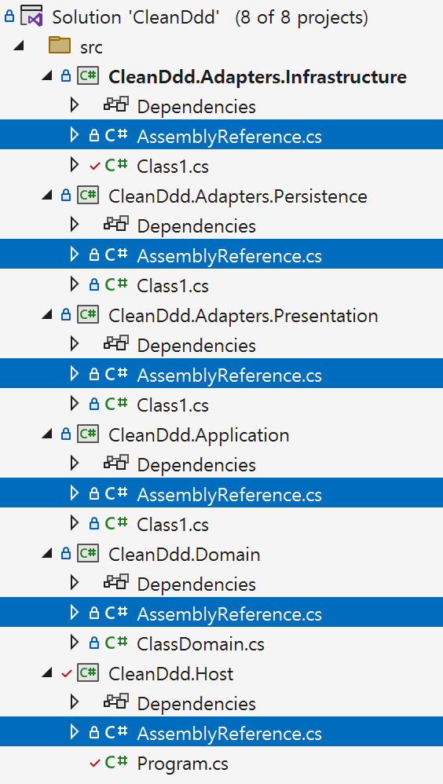

```cs
[Fact]
public void DomainLayer_ShouldNotDependOn_OtherLayers()
{
    // Arrange
    var assembly = Domain.AssemblyReference.Assembly;

    var otherAssemblies = new[]
    {
        Host.AssemblyReference.Assembly.GetName().Name,
        Adapters.Persistence.AssemblyReference.Assembly.GetName().Name,
        Adapters.Infrastructure.AssemblyReference.Assembly.GetName().Name,
        Adapters.Presentation.AssemblyReference.Assembly.GetName().Name,
        Application.AssemblyReference.Assembly.GetName().Name,
    };

    // Act
    var actual = Types
        .InAssembly(assembly)
        .ShouldNot()
        .HaveDependencyOnAny(otherAssemblies)
        .GetResult();

    // Assert
    actual.IsSuccessful.Should().BeTrue();
}
```

- `NetArchTest.Rules` 패키지를 이용하여 의존성을 테스트한다.
- 어셈블리를 접근하기 위해 모든 프로젝트에 `AssemblyReference`을 추가한다.



```cs
using System.Reflection;

namespace CleanDdd.Domain;

public static class AssemblyReference
{
    public static readonly Assembly Assembly = typeof(AssemblyReference).Assembly;
}
```