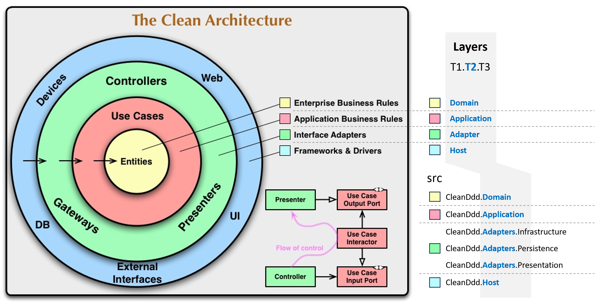

# 아키텍처 규칙

## 솔루션


```
솔루션명
  프로젝트명1                        // 서비스
    src                             // 애플리케이션 레이어
      프로젝트명1
      프로젝트명1.Adapters.Infrastructure
      프로젝트명1.Adapters.Persistence
      프로젝트명1.Adapters.Presentation
      프로젝트명1.Application
      프로젝트명1.Domain
    tests                           // 테스트 레이어
      프로젝트명1.Tests.Integration
      프로젝트명1.Tests.Performance
      프로젝트명1.Tests.Unit
  프로젝트명2                        // 서비스
  tests
    솔루션명.Tests.E2E
```

### 레이어 이름
- 애플리케이션 레이어
  - 기술 관심사
    - `Host`: 프로세스(생략)
    - `Adapter`: 기능
  - 비즈니스 관심사
    - `Application`: UseCase
    - `Domain`: AggregateRoot
- 테스트 레이어
  - `E2E`
  - `Integration`, `Performance`, ...
  - `Unit`

### 애플리케이션 레이어 구성
```
T1.T2{.T3}

src
  ├─ ArchDdd                          : Host(생략)
  ├─ ArchDdd.Adapters.Infrastructure  : Adapter
  ├─ ArchDdd.Adapters.Persistence     : Adapter
  ├─ ArchDdd.Adapters.Presentation    : Adapter
  ├─ ArchDdd.Application              : Application
  └─ ArchDdd.Domain                   : Domain
```
- `T1`: Process 이름
- `T2`: Layer 이름
  - `Domain` ⊂ `Application` ⊂ `Adapter` ⊂ `Host`
- `T3`: Feature 이름(생략 가능)
  - Presentation, Infrastructure, Persistence, ...



### 테스트 레이어 구성
```
T1.T2.T3

tests
  ├─ ArchDdd.Tests.E2E                : Test
  ├─ ArchDdd.Tests.Integration        : Test
  └─ ArchDdd.Tests.Unit               : Test
```
- `T1`: Process 이름
- `T2`: Layer 이름
  - `Test`
- `T3`: Feature 이름(테스트 피라미드)
  - `Unit` ⊂ `Integration` ⊂ `E2E`


### 레이어 식별
- 네임스페이스와 정적 클래스를 이용하여 레이어를 식별하기 위해 `AssemblyReference.cs` 파일을 모든 프로젝트에 생성합니다.

```cs
using System.Reflection;

namespace ArchDdd.Application;    // Application 레이어

public static class AssemblyReference
{
    public static readonly Assembly Assembly = typeof(AssemblyReference).Assembly;
}
```


### 레이어 의존성
```
Host            // 기술 관심사: 프로세스
 ↓
Adapter         // 기술 관심사: Infrastructure, Persistence, Presentation
 ↓
Application     // 비즈니스 관심사: UseCase
 ↓
Domain          // 비즈니스 관심사: AggregateRoot
```


### 레이어 의존성 테스트


```cs
[Fact]
public void DomainLayer_ShouldNotDependOn_AnyLayers()
{
    // Arrange
    var assembly = Domain.AssemblyReference.Assembly;

    var otherAssemblies = new[]
    {
        Host.AssemblyReference.Assembly.GetName().Name,
        Adapters.Persistence.AssemblyReference.Assembly.GetName().Name,
        Adapters.Infrastructure.AssemblyReference.Assembly.GetName().Name,
        Adapters.Presentation.AssemblyReference.Assembly.GetName().Name,
        Application.AssemblyReference.Assembly.GetName().Name,
    };

    // Act
    var actual = Types
        .InAssembly(assembly)
        .ShouldNot()
        .HaveDependencyOnAny(otherAssemblies)
        .GetResult();

    // Assert
    actual.IsSuccessful.Should().BeTrue();
}
```

### Host 레이어 인터페이스
```cs
// Program 어셈블리
//public sealed partial class Program { }
public interface IAppMaker
{

}

// Integration 테스트
public sealed class WebAppFactoryFixture
    //: WebApplicationFactory<Program>
    : WebApplicationFactory<IAppMarker>
    , IAsyncLifetime
{
  // ...
}
```

## 의존성 등록
```

```

## 레이어 소통
### 메시지 처리
```
Middleware --> WebApi Controller --> Pipeline --> UseCase
```
- `Middleware`: ASP.NET WebApi
  - ErrorHandlingMiddleware: 예외 처리
  - RequestTimeMiddleware: 4초 이상 작업 로그
- `Pipeline`: MediatR
  - LoggingPipeline: 성공/실패 로그
  - ValidatorPipeline: UseCase 데이터 유효성 검사

| 순서 | 구분 | 로그 | 기능 |
| --- | --- | --- | --- |
| 1 | ErrorHandlingMiddleware | Error               | 전역 예외 처리 |
| 2 | RequestTimeMiddleware   | Warning             | 4초 이상 |
| 3 | LoggingPipeline         | Information, Error  | 모든 메시지 |
| 4 | ValidatorPipeline       | -                   | 메시지 유효성 검사 |

## 로그
### 구조화 패키지

### 전용 메서드
- 로그 전용 메서드를 이용하여 로그 출력에 의미(예. LogRequestTime)와 형식을 표준화한다.
  - 형식
    - EventId: 로그 식별 값
    - Message: 로그 구조화

```cs

// _log.LogRequestTime
public static partial class LoggerMessageDefinitionsUtilities
{
    [LoggerMessage(
        EventId = 0,
        EventName = $"{nameof(RequestTimeMiddleware)}",
        Level = LogLevel.Warning,
        Message = "Request [{Method}] at {Path} took {Milliseconds} ms",
        SkipEnabledCheck = true)]
    public static partial void LogRequestTime(this ILogger logger,
        string method,
        PathString path,
        double milliseconds);
}
```


## 유스케이스
### 유스케이스
### 유스케이스 단위 구현 방법
- **Entity가 없을(無) 때**
  - `논리 1개 : 인터페이스 메서드 1개 호출(순수 기술)`: 인터페이스 메서드 호출
  - `논리 1개 : 인터페이스 메서드 N개 호출(비즈니스 조합)`: private 메서드에서 N개 인터페이스 메서드 호출
- **Entity가 있을(有) 때**
  - `논리 1개 : Entity 인스턴스 1개`: Entity 메서드 호출
  - `논리 1개 : Entity 인스턴스 N개`: Domain Service 메서드 호출


```
- 의존성 등록
- 레이어 주와 부
  - Abstractions
  - 주
- 유스케이스 이름 규칙
  ...Command
  ...CommandUseCase
  ...CommandValidator
  ...Response
- 인터페이스 이름
- CQRS 인터페이스

솔루션명
  프로젝트명1
    src
      프로젝트명1.Adapters.Infrastructure
        Abstractions
          Constants
          Registrations
            {레이어_이름}LayerRegistration.cs     // 외부 호출
            {의존주입_이름}Registration.cs        // 내부 개별
            ...
            ServiceRegistration.cs               // 내부 통합
          Constants
        AssemblyReference.cs
      프로젝트명1.Adapters.Persistence
      프로젝트명1.Adapters.Presentation
      프로젝트명1.Application
        Abstractions
          Constants
          CQRS
          Registrations
        UseCases
          {UseCase_이름}
            Commands
              {}Command.cs
              {}CommandHandler.cs
              {}CommandValidator.cs
              {}Response.cs
            Events
              {}Evnet.cs
              {}EvnetHandler.cs
              ?
            Queries
              {}Query.cs
              {}QueryHandler.cs
              {}QueryValidator.cs
              {}Response.cs
        AssemblyReference.cs
      프로젝트명1.Domain
        Abstractions
          Constants
        AggregateRoots
          {AggregateRoot_이름}
            ValueObjects
            Events
            Errors
            Enumerations
            {Entity}.cs
            {인터페이스}.cs
            {도메인서비스?}.cs
        AssemblyReference.cs
    tests
      프로젝트명1.Tests.Integration
      프로젝트명1.Tests.Unit
  프로젝트명2
    src
      ...
    tests
      ...
  ...
  tests
    솔루션명.Tests.E2E


Request   {}Command
          {}CommandHandler
          {}CommandValidator
          {}Response            // ? DTO

Response  {}Query
          {}QueryHandler
          {}QueryValidator
          {}Response            // ? DTO


## 의존성 등록
- 목표
  - 레이어 단위로 의존성을 관리한다.
- 폴더 구성
  Abstractions/
    Registration/
      {레이어 이름}LayerRegistration.cs     // 1개
      {기능}Registration.cs                // N개
      {기능}Registration.cs
      ...Registration.cs
- 레이어
  | 레이어 | Registration 존재 有/無 |
  | --- | --- |
  | Host        | 無 | `-`                                          |
  | Adapter     | 有 | `AdapterInfrastructureLayerRegistration.cs`  |
  | Application | 有 | `ApplicationLayerRegistration.cs`            |
  | Domain      | 無 | `-`                                          |

## 환경 설정
### 환경 설정 파일
- 목표
  - `appsettings.json` 파일을 실행 환경 단위로 구성한다.
- 실행 구성
  {
    "profiles": {
      "ArchDdd": {
        "environmentVariables": {
          "ASPNETCORE_ENVIRONMENT": "Development"
        }
      },
      "고형호 | ArchDdd": {
        "environmentVariables": {
          "ASPNETCORE_ENVIRONMENT": "고형호"
        }
      }
    }
  }
  - `launchSettings.json` 파일에 정의된 `ASPNETCORE_ENVIRONMENT` 값을 기준으로 `appsettings.{환경변수}.json` 파일을 읽는다.

### 환경 설정 옵션
- 목표
  - 환경 설정 값을 `appsettings.json`으로 읽는다.
- 주요 구성
  | 구분            | 인터페이스 |
  | --- | --- |
  | 옵션 값            | `-`                     |
  | 옵션 값 구성        | `IConfigureOptions<T>`  |
  | 옵션 값 유효성 검사 | `IValidateOptions<T>`   |
- 적용 예
  // 옵션 값
  DatabaseOptions

  // 옵션 값 구성
  DatabaseOptionsSetup : IConfigureOptions<DatabaseOptions>

  // 옵션 값 유효성 검사
  DatabaseOptionsValidator : IValidateOptions<DatabaseOptions>

### 환경 설정 테스트
- 메모리 `appsettings.json` 자료구조 예.
  {
    "TopLevelKey": "TopLevelValue",
    "SectionName": {
      "SomeKey": "SectionValue"
    }
  }

  var inMemorySettings = new Dictionary<string, string> {
    {"TopLevelKey", "TopLevelValue"},
    {"SectionName:SomeKey", "SectionValue"},
  };

  {
    "ArrayKey": [
      1,
      2,
      3
    ]
  }

  var inMemorySettings = new Dictionary<string, string> {
    {"ArrayKey:0", "1"},
    {"ArrayKey:1", "2"},
    {"ArrayKey:2", "3"},
  };
- 메모리 `appsettings.json` 자료구조 주입
  IConfiguration configuration = new ConfigurationBuilder()
              .AddInMemoryCollection(inMemorySettings!)
              .Build();
```