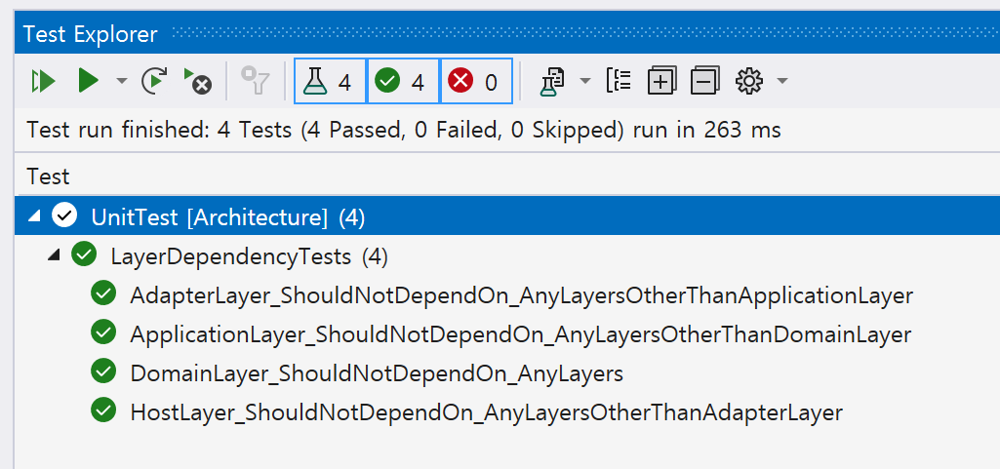

# 레이어 의존성 테스트

## 프로젝트 구분하기
```cs
using System.Reflection;

// 어셈블리 식별을 위한 네임스페이스
namespace ArchDdd.Domain;

public static class AssemblyReference
{
    public static readonly Assembly Assembly = typeof(AssemblyReference).Assembly;
}
```
- 레이어를 구성하는 모든 어셈블리(프로젝트)을 접근하기 위해 `AssemblyReference` 클래스를 구현합니다.

## 레이어 의존성 테스트하기


```cs
[Fact]
public void DomainLayer_ShouldNotDependOn_AnyLayers()
{
    // Arrange
    var assembly = Domain.AssemblyReference.Assembly;

    var otherAssemblies = new[]
    {
        Host.AssemblyReference.Assembly.GetName().Name,
        Adapters.Persistence.AssemblyReference.Assembly.GetName().Name,
        Adapters.Infrastructure.AssemblyReference.Assembly.GetName().Name,
        Adapters.Presentation.AssemblyReference.Assembly.GetName().Name,
        Application.AssemblyReference.Assembly.GetName().Name,
    };

    // Act
    var actual = Types
        .InAssembly(assembly)
        .ShouldNot()
        .HaveDependencyOnAny(otherAssemblies)
        .GetResult();

    // Assert
    actual.IsSuccessful.Should().BeTrue();
}
```