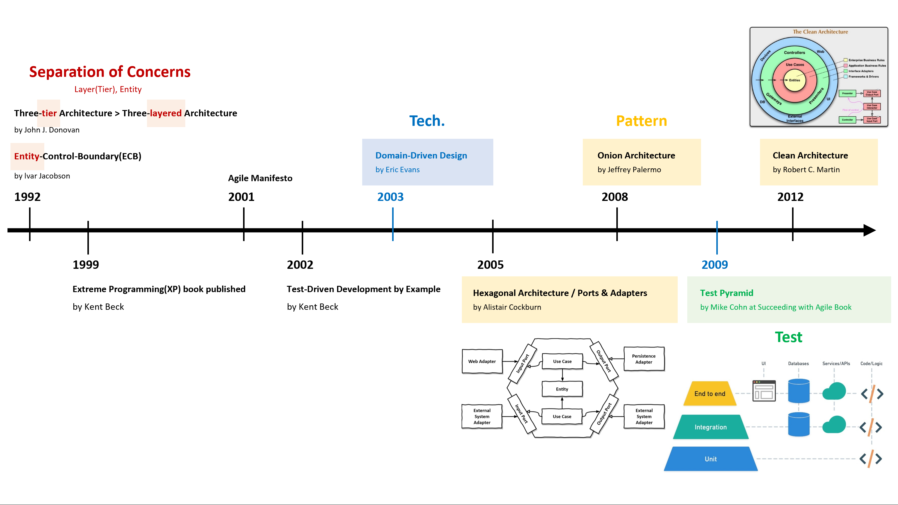

# 아키텍처 이해

## 아키텍처 중요성
건축업자가 프로그래머의 프로그램 작성 방식에 따라 건물을 짓는다면 가장 먼저 도착하는 딱따구리가 문명을 파괴할 것입니다.  
If builders built buildings the way programmers wrote programs, then the first woodpecker that came along would destroy civilization. - Gerald Weinberg
- Architecting is a series of **trade-offs**.
- The architecture should scream **the intent of the system**.

## 아키텍처 원칙
**Separation of Concerns(SoC)은** 중요한 아키텍처 원칙 중 하나입니다. 이는 **관심사**를 분리함으로써 코드를 더 잘 관리할 수 있다는 개념입니다. 아키텍처 수준의 관심사는 각각의 **레이어**로 나눠져 관리됩니다.
> **아키텍처 패턴의 역사**는 **관심사**를 관리하기 위한 **레이어 배치의 역사**입니다.

- Layered Architecture
- Hexagonal Architecture
- Onion Architecture
- Clean Architecture
- ...



## 폴더 구성
### src 폴더 구성


```
T1.T2{.T3}

src
  ├─ ArchDdd.Domain                   : Domain
  ├─ ArchDdd.Application              : Application
  ├─ ArchDdd.Adapters.Infrastructure  : Adapter
  ├─ ArchDdd.Adapters.Persistence     : Adapter
  ├─ ArchDdd.Adapters.Presentation    : Adapter
  └─ ArchDdd.Host                     : Host
```
- `T1`: Solution 이름
- `T2`: Layer 이름
  - `Domain` ⊂ `Application` ⊂ `Adapter` ⊂ `Host`
- `T3`: Feature 이름(생략 가능)
  - Presentation, Infrastructure, Persistence, ...

### tests 폴더 구성


```
T1.T2.T3

tests
  ├─ ArchDdd.Tests.Integration        : Test
  └─ ArchDdd.Tests.Unit               : Test
```
- `T1`: Solution 이름
- `T2`: Layer 이름
  - `Test`
- `T3`: Feature 이름(테스트 피라미드)
  - `Unit` ⊂ `Integration` ⊂ `E2E`