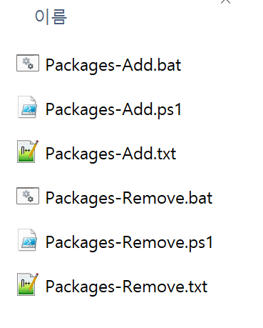

# 패키지 Bulk 추가/제거하기




```shell
Packages-{Feature}.txt      # 패키지 목록
Packages-{Feature}.bat      # Tests와 Src 대상 프로젝트을 구분한 param을 ps1에 전달하여 실행한다
Packages-{Feature}.ps1      # Bulk 패키지 추가/제거한다
```
- Feature: `Add`, `Remove`

## Packages-{Feature}.txt 파일 구성
### Packages-Add.txt
```shell
FluentAssertions 6.12.0
coverlet.collector 6.0.2
```
- 추가할 패키지 이름과 버전을 **공백**으로 구분합니다.
- 행 단위로 추가할 패키지 N개를 기술합니다.
