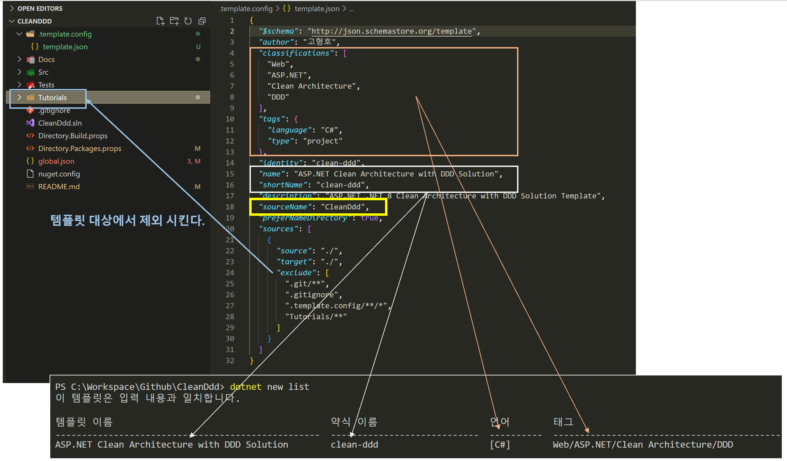

# SDK 템플릿 만들기



```json
{
  "sourceName": "ArchDdd"
}
```
- `sourceName`은 템플릿 생성시 사용자가 지정한 이름으로 바꿀 소스 이름입니다.
- 템플릿 엔진은 폴더 이름과 파일 이름 그리고 파일 내용에서 지정된 `sourceName`을 모두 사용자가 지정한 이름으로 변경합니다.

## SDK 템플릿 파일
```json
{
  "$schema": "http://json.schemastore.org/template",
  "author": "고형호",
  "classifications": [
    "Web",
    "ASP.NET",
    "Clean Architecture",
    "DDD"
  ],
  "tags": {
    "language": "C#",
    "type": "project"
  },
  "identity": "clean-ddd",
  "name": "ASP.NET Clean Architecture with DDD Solution",
  "shortName": "clean-ddd",
  "description": "ASP.NET .NET 8 Clean Architecture with DDD Solution Template",
  "sourceName": "ArchDdd",
  "preferNameDirectory": true,
  "sources": [
    {
      "source": "./",
      "target": "./",
      "exclude": [
        ".git/**",
        ".gitignore",
        ".template.config/**/*",
        "Tutorials/**"
      ]
    }
  ]
}
```
```
템플릿 이름                                       약식 이름      언어     태그
-----------------------------------------------  ------------  -------  --------------------------------------
ASP.NET Clean Architecture with DDD Solution     clean-ddd     [C#]     Web/ASP.NET/Clean Architecture/DDD
```

## SDK 템플릿 주요 명령
```shell
# 템플릿 목록 확인하기
dotnet new list

# 삭제 가능한 템플릿 목록 확인하기
dotnet new uninstall

# 로컬 템플릿 설치하기
#   위치: .template.config 폴더가 있는 경로에서 실행시킨다
#       .template.config
#           template.json
dotnet new install .\

# 로컬 템플릿 제거하기
dotnet new uninstall .\
```

## TODO
- [ ] local nuget 파일 명시적 삭제하기

## 참고 자료
- 템플릿 예제: https://github.com/dotnet/templating/tree/main/dotnet-template-samples
- 사용자 정의: https://learn.microsoft.com/ko-kr/dotnet/core/tools/custom-templates