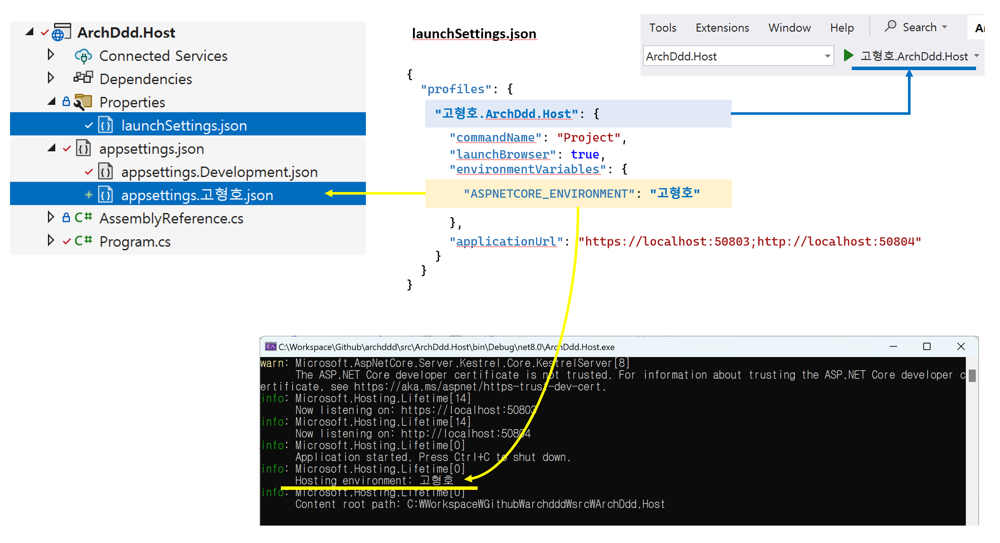
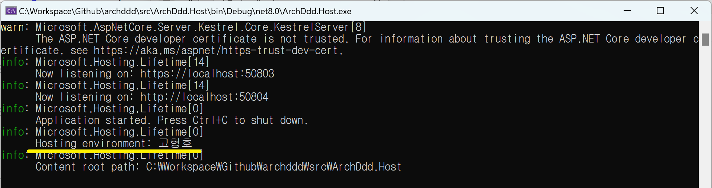

# 옵션

## Registration 클래스 구성
```cs
ArchDdd.Adapters.Infrastructure
  Abstractions
    Registration
      AdapterInfrastructureLayerRegistration.cs
      XxxRegistration
      YyyRegistration
      ZzzRegistration
      ...
```
- `Registration` 폴더에 있는 모든 클래스의 네임스페이스는 `Microsoft.Extensions.DependencyInjection`으로 정의합니다.
- `Host`에서 모든 어셈블리를 직접 참조하지 않고도 `...Registration.cs`에 정의한 `IServiceCollection` 확장 메서드를 접근할 수 있게된다.

## Registration 클래스 이름
```cs
public static class OptionsRegistration
{
    internal static IServiceCollection RegisterOptions(this IServiceCollection services)
```

`XxxRegistration`: 클래스 이름
`RegisterXxx`: 메서드 이름(IServiceCollection` 확장 메서드)

## Options 클래스 구성
```cs
// 호출 순서
// XxxOptionsSetup -> XxxOptionsValidator

XxxOptionsSetup       // 옵션 값 읽기
XxxOptionsValidator   // 옵션 값 유효성 검사
XxxOptions            // 옵션 값
```






```
services.GetOptions<DatabaseOptions>();
```

- [x] 옵션 클래스 구성
- [x] N개 -> 1개 옵션 클래스 구성
- [x] Adapter 레이어, Registration 과정에서 옵션 값 접근하기
- [ ] Adapter 레이어, 생성자에서 옵션 값 접근하기
- [ ] Application 또는 Domain 레이어, 생성자에서 옵션 값 접근하기?
- [ ] FluentValidation 통합
- [ ] 단위 테스트
- [ ] 설정 개인화 appsettings.{호스트명}.json

- [x] [Options pattern in ASP.NET Core](https://learn.microsoft.com/en-us/aspnet/core/fundamentals/configuration/options?view=aspnetcore-8.0)

- [ ] [ASP.NET Core Configuration – Options Validation](https://code-maze.com/aspnet-configuration-options-validation/)


- [ ] [Use multiple environments in ASP.NET Core](https://learn.microsoft.com/en-us/aspnet/core/fundamentals/environments?view=aspnetcore-8.0)
  - Production
  - Development
    - 호스트명

- [ ] [ASP.NET Core performance](https://learn.microsoft.com/en-us/aspnet/core/performance/overview?view=aspnetcore-8.0)

```
dotnet run --environment Production
dotnet run --launch-profile "EnvironmentsSample"
```