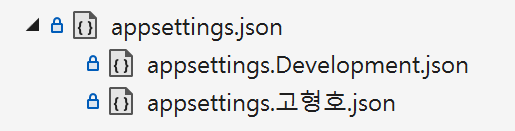
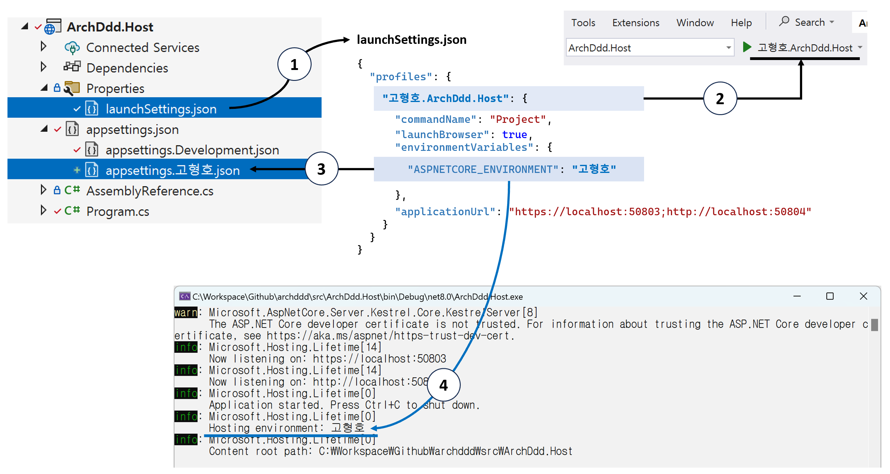
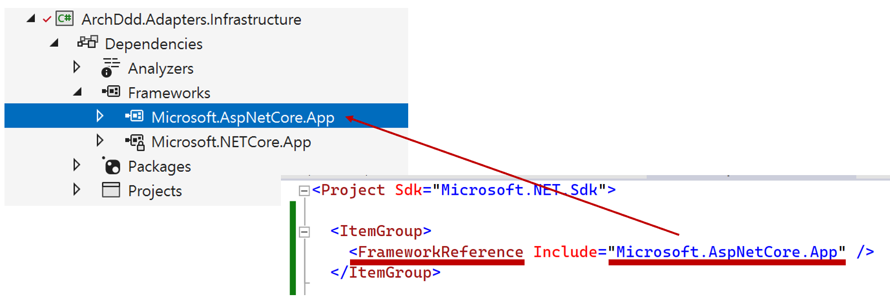

# 환경 설정



```
Abstractions
  Registration                네임스페이스: Microsoft.Extensions.DependencyInjection
    AdapterInfrastructureLayerRegistration
    OptionsRegistration
Options                       호출 순서: XxxOptionsSetup -> XxxOptionsValidator
  DatabaseOptions
  DatabaseOptionsSetup        상속: IConfigureOptions<DatabaseOptions>
  DatabaseOptionsValidator    상속: IValidateOptions<DatabaseOptions>
```

## Registration
```cs
namespace Microsoft.Extensions.DependencyInjection;

public static class AdapterInfrastructureLayerRegistration
{
    public static IServiceCollection RegisterAdapterInfrastructureLayer(this IServiceCollection services)
    {
        services.RegisterOptions();

        return services;
    }
}
```
- `Registration` 폴더에 있는 모든 클래스 네임스페이스는 `Microsoft.Extensions.DependencyInjection`입니다.
- `Host`에서 추가적인 `using` 구문 없이 `...Registration.cs`에 정의한 `Register...` 확장 메서드를 호출할 수 있습니다.

```cs
namespace Microsoft.Extensions.DependencyInjection;

public static class OptionsRegistration
{
    internal static IServiceCollection RegisterOptions(this IServiceCollection services)
    {
        services.ConfigureOptions<DatabaseOptionsSetup>();
        services.AddSingleton<IValidateOptions<DatabaseOptions>, DatabaseOptionsValidator>();

        return services;
    }
}
```
`XxxRegistration`: 클래스 이름
`RegisterXxx`: 메서드 이름(IServiceCollection` 확장 메서드)

## 실행 및 설정 파일



## Framework 참조




```
services.GetOptions<DatabaseOptions>();

public static TOptions GetOptions<TOptions>(this IServiceCollection services)
    where TOptions : class, new()
{
    var serviceProvider = services.BuildServiceProvider();
    return serviceProvider.GetRequiredService<IOptions<TOptions>>().Value;
}
```

## CLI
```
dotnet run --project .\src\ArchDdd.Host\ --launch-profile "고형호.ArchDdd.Host"
dotnet run --project .\src\ArchDdd.Host\ --environment "고형호"

.\ArchDdd.Host.exe --environment "고형호"
```

## 주요 인터페이스
```
IConfigureOptions<T>
{
  void Configure(T options);
}

IValidateOptions<T>
{
  public ValidateOptionsResult Validate(string? name, T options)
}
```

## 규칙
```
public sealed class DatabaseOptions
{
  public const string DatabaseConfig = nameof(DatabaseConfig);
}

public class DatabaseOptionsValidator : AbstractValidator<DatabaseOptions>
```
- DatabaseOptions
  - sealed 클래스
  - `XxxOptions` 클래스 이름
  - `XxxConfig` public const string 변수
- DatabaseOptionsValidator
  - `XxxOptionsValidator` 클래스 이름
  - `AbstractValidator<XxxOptions>` 상속

## TODO
- [x] 옵션 클래스 구성
- [x] N개 -> 1개 옵션 클래스 구성
- [x] Adapter 레이어, Registration 과정에서 옵션 값 접근하기
- [ ] ~~Adapter 레이어, 생성자에서 옵션 값 접근하기~~
- [ ] ~~Application 또는 Domain 레이어, 생성자에서 옵션 값 접근하기?~~
- [x] FluentValidation 통합
- [x] 설정 개인화 `appsettings.{호스트명}.json`
- [x] CLI 모드 지정?
- [ ] 단위 테스트
- [ ] Quartz: https://www.youtube.com/watch?v=iD3jrj3RBuc
- [ ] IConfigureOptions?

## 참고 자료
- [x] [Options pattern in ASP.NET Core](https://learn.microsoft.com/en-us/aspnet/core/fundamentals/configuration/options?view=aspnetcore-8.0)
- [ ] [ASP.NET Core Configuration – Options Validation](https://code-maze.com/aspnet-configuration-options-validation/)
- [ ] [Use multiple environments in ASP.NET Core](https://learn.microsoft.com/en-us/aspnet/core/fundamentals/environments?view=aspnetcore-8.0)
  - Production
  - Development
    - 호스트명
- [ ] [ASP.NET Core performance](https://learn.microsoft.com/en-us/aspnet/core/performance/overview?view=aspnetcore-8.0)
