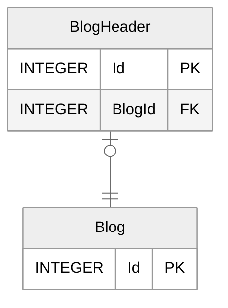
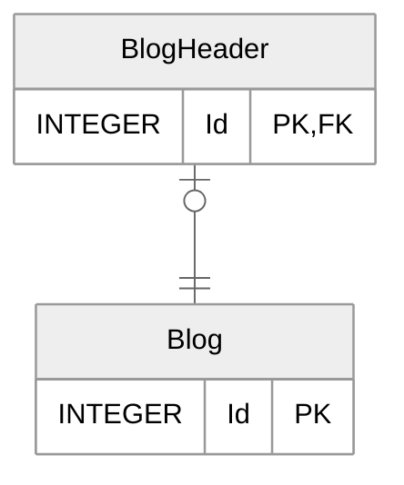

# 일대일 관계
- [One-to-one relationships](https://learn.microsoft.com/en-us/ef/core/modeling/relationships/one-to-one)

```sql
SELECT sqlite_version();
```

## Required one-to-one

<!--- SIREN_START -->

<!--- SIREN_END -->

```sql
CREATE TABLE "Blogs"(
  "Id" INTEGER NOT NULL CONSTRAINT "PK_Blogs" PRIMARY KEY AUTOINCREMENT
)

CREATE TABLE "BlogHeaders" (
  "Id" INTEGER NOT NULL CONSTRAINT "PK_BlogHeaders" PRIMARY KEY AUTOINCREMENT,
  "BlogId" INTEGER NOT NULL,
  CONSTRAINT "FK_BlogHeaders_Blogs_BlogId" FOREIGN KEY ("BlogId") REFERENCES "Blogs" ("Id") ON DELETE CASCADE
)

CREATE UNIQUE INDEX "IX_BlogHeaders_BlogId" ON "BlogHeaders" ("BlogId")
```

```cs
// Principal (parent)
public class Blog
{
  public int Id { get; set; }
  public BlogHeader? Header { get; set; } // Reference navigation to dependent
}

// Dependent (child)
public class BlogHeader
{
  public int Id { get; set; }
  public int BlogId { get; set; } // Required foreign key property
  public Blog Blog { get; set; } = null!; // Required reference navigation to principal
}
```

```cs
protected override void OnModelCreating(ModelBuilder builder)
{
  builder.Entity<Blog>()
    .HasOne(blog => blog.Header)
    .WithOne(blogHeader => blogHeader.Blog)
    .HasForeignKey<BlogHeader>(blogHeader => blogHeader.BlogId)
    .IsRequired();
}
```

## Required one-to-one with primary key to primary key relationship
<!--- SIREN_START -->

<!--- SIREN_END -->

```sql
CREATE TABLE "Blogs"(
      "Id" INTEGER NOT NULL CONSTRAINT "PK_Blogs" PRIMARY KEY AUTOINCREMENT
)

CREATE TABLE "BlogHeaders" (
  "Id" INTEGER NOT NULL CONSTRAINT "PK_BlogHeaders" PRIMARY KEY,
  CONSTRAINT "FK_BlogHeaders_Blogs_Id" FOREIGN KEY ("Id") REFERENCES "Blogs" ("Id") ON DELETE CASCADE
)
```

```cs
// Principal (parent)
public class Blog
{
  public int Id { get; set; }
  public BlogHeader? Header { get; set; } // Reference navigation to dependent
}

// Dependent (child)
public class BlogHeader
{
  public int Id { get; set; }
  public Blog Blog { get; set; } = null!; // Required reference navigation to principal
}
```

```cs
protected override void OnModelCreating(ModelBuilder builder)
{
  // 암시적
  builder.Entity<Blog>()
    .HasOne(blog => blog.Header)
    .WithOne(blogHeader => blogHeader.Blog)
    .HasForeignKey<BlogHeader>();           // <-- primary key relationship

  // 명시적
  //builder.Entity<Blog>()
  //  .HasOne(blog => blog.Header)
  //  .WithOne(blogHeader => blogHeader.Blog)
  //  .HasForeignKey<BlogHeader>(blogHeader => blogHeader.Id)
  //  .IsRequired();
}
```

## Required one-to-one with shadow foreign key

<!--- SIREN_START -->

<!--- SIREN_END -->

```sql
CREATE TABLE "Blogs" (
    "Id" INTEGER NOT NULL CONSTRAINT "PK_Blogs" PRIMARY KEY AUTOINCREMENT
)

CREATE TABLE "BlogHeaders" (
    "Id" INTEGER NOT NULL CONSTRAINT "PK_BlogHeaders" PRIMARY KEY AUTOINCREMENT,
    "BlogId" INTEGER NOT NULL,
    CONSTRAINT "FK_BlogHeaders_Blogs_BlogId" FOREIGN KEY ("BlogId") REFERENCES "Blogs" ("Id") ON DELETE CASCADE
)

CREATE UNIQUE INDEX "IX_BlogHeaders_BlogId" ON "BlogHeaders" ("BlogId")
```

```cs
// Principal (parent)
public class Blog
{
  public int Id { get; set; }
  public BlogHeader? Header { get; set; } // Reference navigation to dependent
}

// Dependent (child)
public class BlogHeader
{
  public int Id { get; set; }
  public Blog Blog { get; set; } = null!; // Required reference navigation to principal
}
```

```cs
protected override void OnModelCreating(ModelBuilder builder)
{
  builder.Entity<Blog>()
    .HasOne(blog => blog.Header)
    .WithOne(blogHeader => blogHeader.Blog)
    .HasForeignKey<BlogHeader>("BlogId");       // <-- shadow foreign key
}
```