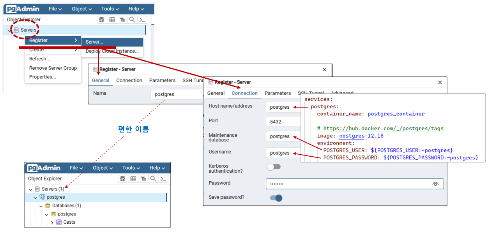

# 기본 설치

## 컨테이너
### 컨테이너 환경 설정
| 환경 변수                     | 기본 값               |
| --- | --- |
| POSTGRES_USER               | postgres              |
| POSTGRES_PASSWORD           | postgres              |
| POSTGRES_PORT               | 5432                  |
| PGADMIN_PORT                | 5050                  |
| PGADMIN_DEFAULT_EMAIL       | pgadmin4@pgadmin.org  |
| PGADMIN_DEFAULT_PASSWORD    | admin                 |

### 컨테이너 구성
```shell
# 이미지 로드
docker image load -i postgres-12.18.tar
docker image load -i dpage.pgadmin4-8.5.tar
docker image ls

# 컨테이너 실행
docker-compose up -d

# 컨테이너 볼륨 확인
docker volume ls

# 컨테이너 중지
docker-compose down         # 컨테이너 중지
docker-compose down -v      # 컨테이너 중지, 볼륨 삭제
```

<br/>

## 컨테이너
### Postgre
- localhost:5432
  - 포트: 5432
  - 계정: postgres
  - 암호: postgres

### pgAdmin 접속하기
- http://localhost:5050
  - 계정: pgadmin4@pgadmin.org
  - 암호: admin



<br/>

## PostgreSQL
### 테이블 생성
```sql
CREATE TABLE links (
  id SERIAL PRIMARY KEY,
  url VARCHAR(255) NOT NULL,
  name VARCHAR(255) NOT NULL,
  description VARCHAR (255),
  last_update DATE
);
```

### 데이터 Insert & Select
```sql
## 1. insert
INSERT INTO links (url, name)
VALUES('https://www.postgresqltutorial.com','PostgreSQL Tutorial');

SELECT * FROM links;

## 2. '기호: ''
INSERT INTO links (url, name)
VALUES('http://www.oreilly.com','O''Reilly Media');

SELECT * FROM links;

## 3. 최근 시간
INSERT INTO links (url, name, last_update)
VALUES('https://www.google.com','Google','2013-06-01');

## 4. 결과 값
INSERT INTO links (url, name)
VALUES('https://www.postgresql.org','PostgreSQL')
RETURNING id;

## 5. 모든 결과 값
INSERT INTO links (url, name)
VALUES('https://www.postgresql.org','PostgreSQL')
RETURNING *;
```