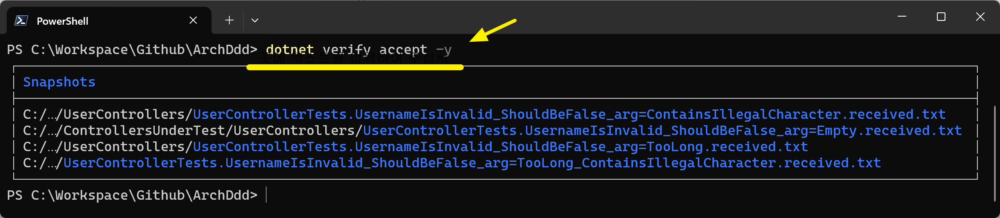
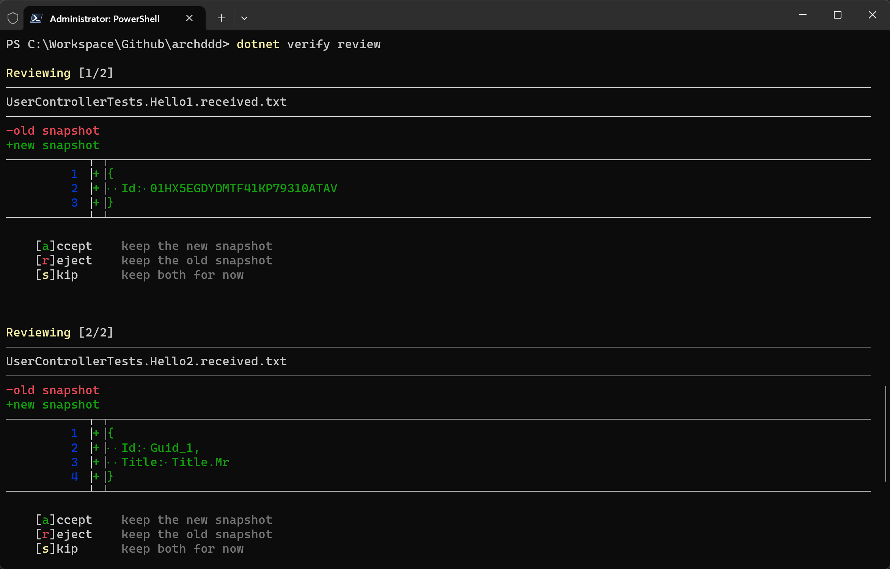

# Verify

## 구성
- .gitattributes
  ```
  *.verified.txt text eol=lf working-tree-encoding=UTF-8
  *.verified.xml text eol=lf working-tree-encoding=UTF-8
  *.verified.json text eol=lf working-tree-encoding=UTF-8
  ```
- .gitignore
  ```
  *.received.*
  ```
- verify.tool 도구 설치
  ```powershell
  dotnet tool install -g verify.tool
  ```

## verify CLI
```powershell
# *.received.txt 모든 파일을 .verified.txt 파일로 변환한다.
dotnet verify accept -y
dotnet verify accept -y -w 특정_경로
```


```powershell
# *.received.txt 모든 파일을 삭제한다.
dotnet verify reject -y
dotnet verify reject -y -w 특정_경로
```

```powershell
# *.received.txt 파일 단위로 .verified.txt 생성을 결정한다.
dotnet verify review
```



### WebAPI 통합 테스트
- WebAPI 생성: Microsoft.AspNetCore.Mvc.Testing
  ```cs
  var webAppFactory = new WebApplicationFactory<Program>();
  using var httpClient = webAppFactory.CreateDefaultClient();
  ```
- WebAPI 호출: System.Net.Http.Json
  ```cs
  PostAsJsonAsync<T>
  ReadFromJsonAsync<T>
  ```

### Verify 테스트 자동화
- 폴더 지정
  ```cs
  public static class Settings
  {
      [ModuleInitializer]
      public static void Initialize()
      {
          // https://github.com/VerifyTests/Verify/blob/main/docs/naming.md
          Verifier.UseProjectRelativeDirectory("Snapshots");

          // 실패시 파일 비교창 비활성화
          DiffRunner.Disabled = true;
      }
  }
  ```
- 파라미터 지정
  ```
  [Theory]
  [InlineData("1")]
  [InlineData("2")]
  public async Task GetStudentById(string id)
  {
      // ...

      await VerifyJson(student)
           .UseParameters(id);            // https://github.com/VerifyTests/Verify/blob/main/docs/parameterised.md


      using var response = await httpClient.GetAsync($"api/students/{id}");
      var student = await response.Content.ReadAsStringAsync();
      await VerifyJson(student)
          .UseParameters(id);
  }
  ```
  - StudentControllerTest.GetStudentById_id`=1`.verified.txt
  - StudentControllerTest.GetStudentById_id`=2`.verified.txt
- TODO
  - [x] 특정 폴더 결과 생성: `Verifier.UseProjectRelativeDirectory`
  - [x] InlineData 처리: `UseParameters`
  - [ ] .txt -> .json 확장자 변경
  - [x] 실패시 파일 비교 비활성화

