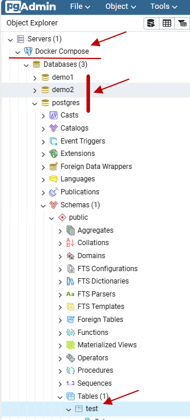

# 환경 구성 자동화



## pgAdmin 자동화
### 서버 추가
```yml
volumes:
  - ./docker_pgadmin_servers.json:/pgadmin4/servers.json
```

```json
{
  "Servers": {
    "1": {
      "Name": "Docker Compose",
      "Group": "Servers",
      "Port": 5432,
      "Username": "postgres",
      "Host": "postgres",
      "SSLMode": "prefer",
      "MaintenanceDB": "postgres",
      "PassFile": "/tmp/pgpassfile"
    }
  }
}
```

### PassFile 파일
```yml
# hostname:port:database:username:password
entrypoint:
  - "/bin/sh"
  - "-c"
  - "/bin/echo 'postgres:5432:*:postgres:postgres' > /tmp/pgpassfile && chmod 600 /tmp/pgpassfile && /entrypoint.sh"
```

<br/>

## PostgreSQL 자동화
### 데이터베이스 생성
```yml
volumes:
  - ./docker_postgres_init.sql:/docker-entrypoint-initdb.d/init.sql
```

```sql
-- 데이터베이스 생성
CREATE DATABASE demo1
    WITH
    OWNER = postgres
    ENCODING = 'UTF8'
    LC_COLLATE = 'en_US.utf8'
    LC_CTYPE = 'en_US.utf8'
    TABLESPACE = pg_default
    CONNECTION LIMIT = -1;

CREATE DATABASE demo2
    WITH
    OWNER = postgres
    ENCODING = 'UTF8'
    LC_COLLATE = 'en_US.utf8'
    LC_CTYPE = 'en_US.utf8'
    TABLESPACE = pg_default
    CONNECTION LIMIT = -1;

-- 테이블 생성
CREATE TABLE test(
  id INT PRIMARY KEY GENERATED ALWAYS AS IDENTITY,
  name TEXT NOT NULL,
  archived BOOLEAN NOT NULL DEFAULT FALSE
);

-- 데이터 추가
INSERT INTO test (name, archived)
  VALUES ('test row 1', true),
  ('test row 2', false);
```

