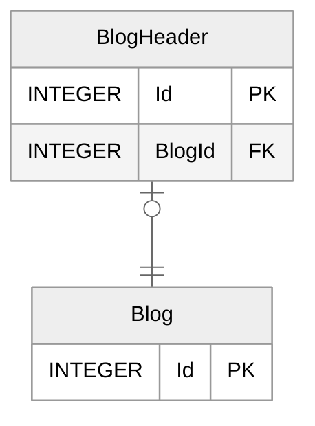

<!--- SIREN_START -->

```mermaid
	%%{init: {'theme':'neutral'}}%%
	erDiagram
	Blog {
		INTEGER Id PK
	}
	BlogHeader {
		INTEGER Id PK
		INTEGER BlogId FK
	}
BlogHeader|o--||Blog : ""
```
<!--- SIREN_END -->
