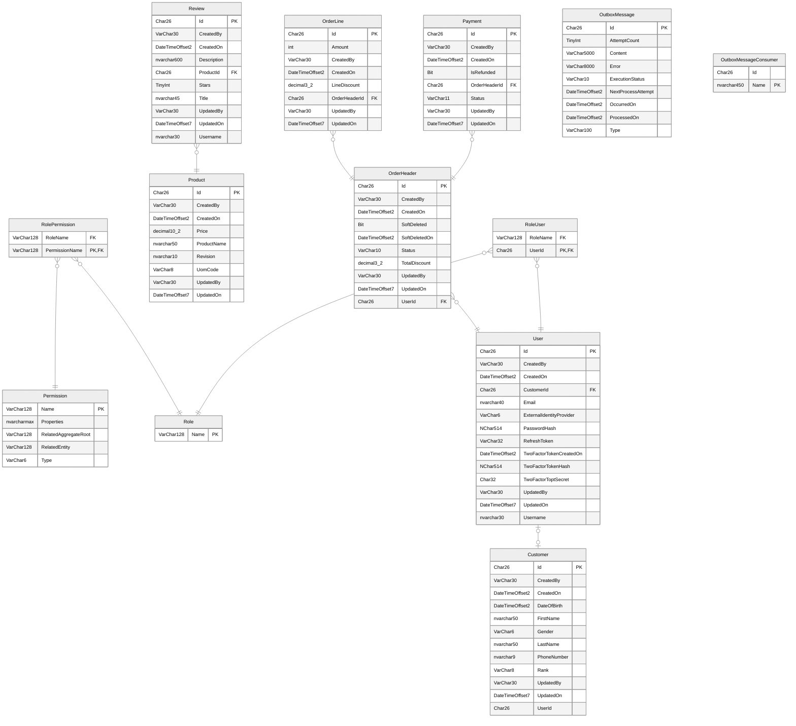

<!--- SIREN_START -->

```mermaid
	%%{init: {'theme':'neutral'}}%%
	erDiagram
	OrderHeader {
		Char26 Id PK
		VarChar30 CreatedBy 
		DateTimeOffset2 CreatedOn 
		Bit SoftDeleted 
		DateTimeOffset2 SoftDeletedOn 
		VarChar10 Status 
		decimal3_2 TotalDiscount 
		VarChar30 UpdatedBy 
		DateTimeOffset7 UpdatedOn 
		Char26 UserId FK
	}
	OrderLine {
		Char26 Id PK
		int Amount 
		VarChar30 CreatedBy 
		DateTimeOffset2 CreatedOn 
		decimal3_2 LineDiscount 
		Char26 OrderHeaderId FK
		VarChar30 UpdatedBy 
		DateTimeOffset7 UpdatedOn 
	}
	Payment {
		Char26 Id PK
		VarChar30 CreatedBy 
		DateTimeOffset2 CreatedOn 
		Bit IsRefunded 
		Char26 OrderHeaderId FK
		VarChar11 Status 
		VarChar30 UpdatedBy 
		DateTimeOffset7 UpdatedOn 
	}
	Product {
		Char26 Id PK
		VarChar30 CreatedBy 
		DateTimeOffset2 CreatedOn 
		decimal10_2 Price 
		nvarchar50 ProductName 
		nvarchar10 Revision 
		VarChar8 UomCode 
		VarChar30 UpdatedBy 
		DateTimeOffset7 UpdatedOn 
	}
	Review {
		Char26 Id PK
		VarChar30 CreatedBy 
		DateTimeOffset2 CreatedOn 
		nvarchar600 Description 
		Char26 ProductId FK
		TinyInt Stars 
		nvarchar45 Title 
		VarChar30 UpdatedBy 
		DateTimeOffset7 UpdatedOn 
		nvarchar30 Username 
	}
	Permission {
		VarChar128 Name PK
		nvarcharmax Properties 
		VarChar128 RelatedAggregateRoot 
		VarChar128 RelatedEntity 
		VarChar6 Type 
	}
	Role {
		VarChar128 Name PK
	}
	RolePermission {
		VarChar128 RoleName FK
		VarChar128 PermissionName PK,FK
	}
	RoleUser {
		VarChar128 RoleName FK
		Char26 UserId PK,FK
	}
	Customer {
		Char26 Id PK
		VarChar30 CreatedBy 
		DateTimeOffset2 CreatedOn 
		DateTimeOffset2 DateOfBirth 
		nvarchar50 FirstName 
		VarChar6 Gender 
		nvarchar50 LastName 
		nvarchar9 PhoneNumber 
		VarChar8 Rank 
		VarChar30 UpdatedBy 
		DateTimeOffset7 UpdatedOn 
		Char26 UserId 
	}
	User {
		Char26 Id PK
		VarChar30 CreatedBy 
		DateTimeOffset2 CreatedOn 
		Char26 CustomerId FK
		nvarchar40 Email 
		VarChar6 ExternalIdentityProvider 
		NChar514 PasswordHash 
		VarChar32 RefreshToken 
		DateTimeOffset2 TwoFactorTokenCreatedOn 
		NChar514 TwoFactorTokenHash 
		Char32 TwoFactorToptSecret 
		VarChar30 UpdatedBy 
		DateTimeOffset7 UpdatedOn 
		nvarchar30 Username 
	}
	OutboxMessage {
		Char26 Id PK
		TinyInt AttemptCount 
		VarChar5000 Content 
		VarChar8000 Error 
		VarChar10 ExecutionStatus 
		DateTimeOffset2 NextProcessAttempt 
		DateTimeOffset2 OccurredOn 
		DateTimeOffset2 ProcessedOn 
		VarChar100 Type 
	}
	OutboxMessageConsumer {
		Char26 Id 
		nvarchar450 Name PK
	}
OrderHeader}o--||User : ""
OrderLine}o--||OrderHeader : ""
Payment}o--||OrderHeader : ""
Review}o--||Product : ""
RolePermission}o--||Permission : ""
RolePermission}o--||Role : ""
RoleUser}o--||Role : ""
RoleUser}o--||User : ""
User|o--o|Customer : ""
```
<!--- SIREN_END -->
