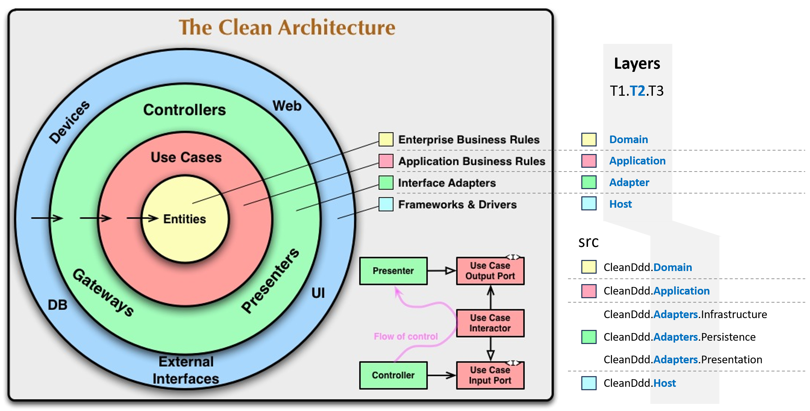

### src 폴더 구성


```
T1.T2{.T3}

src
  ├─ CleanDdd.Domain                   : Domain
  ├─ CleanDdd.Application              : Application
  ├─ CleanDdd.Adapters.Infrastructure  : Adapter
  ├─ CleanDdd.Adapters.Persistence     : Adapter
  ├─ CleanDdd.Adapters.Presentation    : Adapter
  └─ CleanDdd.Host                     : Host
```
- `T1`: Solution 이름
- `T2`: Layer 이름
  - `Domain` ⊂ `Application` ⊂ `Adapter` ⊂ `Host`
- `T3`: Feature 이름(생략 가능)
  - Presentation, Infrastructure, Persistence, ...

### tests 폴더 구성


```
T1.T2.T3

tests
  ├─ CleanDdd.Tests.Integration        : Test
  └─ CleanDdd.Tests.Unit               : Test
```
- `T1`: Solution 이름
- `T2`: Layer 이름
  - `Test`
- `T3`: Feature 이름(테스트 피라미드)
  - `Unit` ⊂ `Integration` ⊂ `E2E`