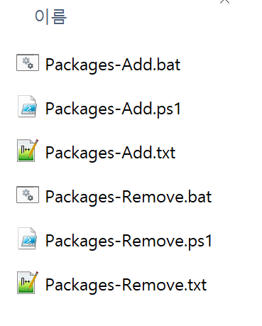

# 패키지 Bulk 추가/제거하기



```shell
Packages-{Feature}.txt      # 패키지 목록
Packages-{Feature}.bat      # Tests와 Src 대상 프로젝트을 구분한 param을 ps1에 전달하여 실행한다
Packages-{Feature}.ps1      # Bulk 패키지 추가/제거한다
```
- Feature: `Add`, `Remove`

## Packages-{Feature}.txt 파일 구성
### Packages-Add.txt
```txt
FluentAssertions 6.12.0
coverlet.collector 6.0.2
```
- 추가할 패키지 이름과 버전을 **공백**으로 구분합니다.
- 행 단위로 추가할 패키지 N개를 기술합니다.

### Packages-Remove.txt
```txt
FluentAssertions
coverlet.collector
```
- 제거할 패키지 이름을 기술합니다.
- 행 단위로 제거할 패키지 N개를 기술합니다.

## Packages-{Feature}.bat
```bat
set param=Tests
powershell -File "./Packages-Add.ps1" "%param%"
```
- 테스트 프로젝트에 패키지를 추가할 때는 `param`에 `tests`을 전단합니다(대소문 구분 없음).

## Packages-{Feature}.ps1
```powershell
$project_dirs = @()
if ($param -ieq "tests") {
    $project_dirs = Get-ChildItem -Path (Join-Path $root_dir "..\..\") `
        -Recurse `
        -Filter *.csproj `
        -Include *.Tests.* `
        -ErrorAction SilentlyContinue
}
else {
    $project_dirs = Get-ChildItem -Path (Join-Path $root_dir "..\..\") `
        -Recurse `
        -Filter *.csproj `
        -Exclude *.Tests.* `
        -ErrorAction SilentlyContinue
}

$project_dirs | ForEach-Object {
    foreach ($package in $packages) {
        $packageName, $packageVersion = $package -split ' '
        dotnet add "$($_.FullName)" package $packageName --version $packageVersion
    }
}
```
- Tests 프로젝트일 때: `-Include *.Tests.* `
- Tests 프로젝트가 아닐 때: `-Exclude *.Tests.*`